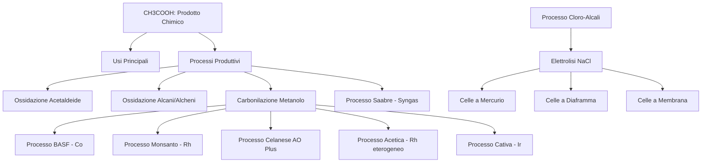

# Sintesi Accademica: Produzione Industriale di Acido Acetico e Processo Cloro-Alcali

## Mappa Concettuale del Percorso

## PARTE 1: ACIDO ACETICO (CH₃COOH)

### 1. Inquadramento del Prodotto

> 📌 **Definizione Rigorosa:**
> - **Formula:** CH₃COOH
> - **Peso Molecolare:** 60.05 g/mol
> - **CAS:** 64-19-7
> - **Stato:** Concentrato è molto corrosivo
> - **Produzione globale:** ~6.5 Mt/y (di cui 1.5 Mt/y da riciclo)

**Distribuzione produttiva:** Metà negli USA, ~1 Mt/y in Europa, ~0.7 Mt/y in Giappone. Principali produttori: Celanese (Texas) e BP Chemicals (UK).

### 2. Usi Industriali e Derivati

#### 2.1 Vinil Acetato (VAc) — 35% della produzione
$$2\text{CH}_3\text{COOH} + 2\text{C}_2\text{H}_4 + \text{O}_2 \xrightarrow{\text{Pd}} 2\text{CH}_3\text{COOCH}=\text{CH}_2 + 2\text{H}_2\text{O}$$

**Catena dei derivati:** VAc → Poli(vinil acetato) → vernici, adesivi → Poli(vinil alcol) (PVA)

#### 2.2 Esteri
$$\text{CH}_3\text{COOH} + \text{R-OH} \rightarrow \text{CH}_3\text{COOR} + \text{H}_2\text{O}$$
(Etil, n-butil, propil, isobutil acetato)

#### 2.3 Altri Usi
- **Anidride acetica** (25-30%): condensazione di 2 molecole di acido acetico
- **Acetato di cellulosa**
- **Industria farmaceutica:** aspirina (acido acetilsalicilico)
- **Industria alimentare:** regolatore di acidità
- **Solvente** in ossidazioni (es. processo Amoco per acido tereftalico → PET)
- Industria di coloranti e pesticidi

#### 2.4 Trasporto
- Contenitori: vetro, polietilene, acciaio rivestito di ceramica
- **Punto di cristallizzazione:** 16°C → trasporto a T > 20°C

### 3. Processi Produttivi Principali

| Processo | Anno | Catalizzatore | Condizioni | Resa |
|----------|------|---------------|------------|------|
| Ossidazione acetaldeide | 1916 | Hg (poi senza) | — | — |
| BASF (carbonilazione) | 1913/1963 | Co | 600-700 atm, 200-250°C | ~90% |
| Monsanto | 1970 | Rh | 34 atm, 150-180°C | >99% |
| Celanese AO Plus | 1980 | Rh + LiI | H₂O 4-5% | — |
| Cativa (BP) | 1996 | Ir + Ru | H₂O ~5% | — |
| Acetica (Chiyoda) | 1999 | Rh eterogeneo | 30-60 atm, 160-200°C | 99% |

> **Stato attuale:** ~65% del CH₃COOH globale è prodotto per carbonilazione del metanolo.

### 4. Carbonilazione del Metanolo: Meccanismo Generale

$$\text{CH}_3\text{OH} + \text{CO} \rightarrow \text{CH}_3\text{COOH}$$

#### 4.1 Processo BASF (Cobalto)

**Precursore catalitico:** CoI₂ | **Promotore:** I⁻ | **Condizioni:** 600-700 atm, 200-250°C, 15% H₂O

**Formazione specie attiva:**
$$2\text{CoI}_2 + 2\text{H}_2\text{O} + 10\text{CO} \rightleftharpoons \text{Co}_2(\text{CO})_8 + 4\text{HI} + 2\text{CO}_2$$
$$\text{CO} + \text{H}_2\text{O} \rightleftharpoons \text{CO}_2 + \text{H}_2 \quad (\text{WGSR})$$
$$\text{Co}_2(\text{CO})_8 + \text{H}_2 \rightleftharpoons 2\text{HCo}(\text{CO})_4 \rightleftharpoons 2\text{HCo}(\text{CO})_3 + 2\text{CO}$$

**Ciclo catalitico:**
1. **Formazione CH₃I:** HI + CH₃OH ⇌ CH₃I + H₂O
2. **Addizione ossidativa:** [Co(CO)₄]⁻ + CH₃I ⇌ [Co(CH₃)(CO)₄] + I⁻ (Co: +1 → +3)
3. **Inserzione CO:** [Co(CH₃)(CO)₄] + CO ⇌ [Co(COCH₃)(CO)₄] (Co: +3)
4. **Eliminazione riduttiva:** [Co(COCH₃)(CO)₄] + I⁻ ⇌ [Co(CO)₄]⁻ + CH₃COI (Co: +3 → +1)
5. **Idrolisi:** CH₃COI + H₂O ⇌ CH₃COOH + HI

> ⚠️ **Attenzione / Errore Tipico d'Esame:**
> - Lo **stadio limitante** è la formazione di [Co(COCH₃)(CO)₃] (passaggio 3, prima dell'eliminazione riduttiva)
> - Il complesso [Co(Me)(CO)₄] è d⁸ e relativamente stabile
> - I⁻ attacca (3) per riformare la specie attiva (1) e CH₃COI

**Reazioni secondarie (perdite):**
- CO + H₂O ⇌ HCOOH → perdita 10% CO (con WGSR)
- H₂ + CH₃OH → CH₄ → perdita 3.5% CH₃OH
- Formazione di etanolo, esteri, eteri → perdita 4.5% CH₃OH

#### 4.2 Processo Monsanto (Rodio)

**Condizioni:** 30-60 atm, 150-200°C | **Catalizzatore:** sale di Rh, [Rh] = 10⁻³ M | **Promotore:** I⁻ | **H₂O:** <15%

**Selettività:** 99% verso MeOH, 85% verso CO

**Vantaggi vs BASF:**
- P e T più basse
- Catalizzatore meno sensibile a H₂ → minori reazioni secondarie → migliore selettività

**Svantaggi:**
- Alto costo del Rh
- Miscela corrosiva

**Formazione specie attiva:**
$$\text{RhI}_3 + 3\text{CO} + \text{H}_2\text{O} \rightleftharpoons [\text{RhI}_2(\text{CO})_2]^- + \text{CO}_2 + 2\text{H}^+ + \text{I}^-$$
$$\text{HI} + \text{CH}_3\text{OH} \rightleftharpoons \text{CH}_3\text{I} + \text{H}_2\text{O}$$

**Ciclo catalitico:**
1. **Addizione ossidativa (stadio limitante):** CH₃I + [RhI₂(CO)₂]⁻ ⇌ [RhI₃(CH₃)(CO)₂]⁻ (Rh: +1 → +3)
2. **Inserzione migratoria di CO:** [RhI₃(CH₃)(CO)₂]⁻ → [RhI₃(COCH₃)(CO)]⁻
3. **Coordinazione CO + Eliminazione riduttiva:** [RhI₃(COCH₃)(CO)]⁻ + CO ⇌ [RhI₃(COCH₃)(CO)₂]⁻ → [RhI₂(CO)₂]⁻ + CH₃COI
4. **Idrolisi:** CH₃COI + H₂O ⇌ CH₃COOH + HI

> 📌 **Cinetica del Processo Monsanto:**
> - Stadio limitante: addizione ossidativa
> - $v \propto [\text{RhI}_2(\text{CO})_2^-][\text{CH}_3\text{I}]$
> - **Primo ordine** in Rh e CH₃I
> - **Indipendente** da [CH₃OH] e P(CO)
> - Se H₂O < 8% → stadio limitante diventa l'eliminazione riduttiva

**Ruolo dell'acqua (WGSR):**
$$\text{H}_2\text{O} + \text{CO} \rightleftharpoons \text{CO}_2 + \text{H}_2$$

**Stabilizzazione del catalizzatore:**
$$[\text{Rh}(\text{CO})_2\text{I}_2]^- + 2\text{HI} \rightleftharpoons [\text{Rh}(\text{CO})\text{I}_4]^- + \text{H}_2 + \text{CO}$$
$$[\text{Rh}(\text{CO})\text{I}_4]^- \rightleftharpoons \text{RhI}_3 + \text{I}^- + \text{CO} \quad (\text{perdita catalizzatore})$$
$$[\text{Rh}(\text{CO})\text{I}_4]^- + \text{H}_2\text{O} + 2\text{CO} \rightleftharpoons [\text{Rh}(\text{CO})_2\text{I}_2]^- + \text{CO}_2 + 2\text{HI}$$

**Prodotti secondari:** CO₂, H₂, acido propionico, acetaldeide, altri acidi carbossilici, aldeidi, aldoli, alcoli → olefine superiori → acidi a lunga catena (difficili da separare)

#### 4.3 Processo Celanese (Acid Optimization Plus)

**Innovazione chiave:** Introduzione di ioduri alcalini (LiI) per abbassare H₂O < 5%

**Effetti:**
- Diminuzione reazioni secondarie responsabili della perdita di Rh
- Eccesso di ioduri → residuo 20 ppb HI → ridotto a 1 ppb con resine a scambio ionico contenenti Ag

**Meccanismo proposto:** LiI favorisce la formazione di specie dianioniche [RhI₃(CO)₂]²⁻
- Più nucleofilico di [RhI₂(CO)₂]⁻
- → Addizione ossidativa più veloce

#### 4.4 Processo Acetica (Chiyoda) — Catalisi Eterogenea

**Catalizzatore:** [Rh(CO)₂I₂]⁻ supportato su polivinilpiridina (PVP) quaternizzata con CH₃I

**Condizioni:** 160-200°C, 30-60 atm, H₂O 3-7%

**Selettività:** 99-100% verso MeOH, 90% verso CO | **Resa:** 98%

**Vantaggi:**
- Catalizzatore: alta attività, stabilità, lunga vita (>7000 h), facile recupero
- Bassa H₂O (3-7%) e senza promotori → diminuisce WGSR → minori composti idrogenati
- Miscela meno corrosiva

**Reattore a bolla:**
- Nessuna agitazione meccanica
- CH₃OH e CO inseriti dal basso
- CO disperso su piastra forata → agita la soluzione

**Materiali impianto:**
- AISI 316: Cr 16-18%, Ni 10-14%, Mo 2-3%
- AISI 321: Cr 17-19%, Ni 9-12%, Ti >0.4%

#### 4.5 Processo Cativa (BP) — Iridio

**Catalizzatore:** [Ir(CO)₂I₂]⁻ | **Promotore:** [Ru(CO)₂I₂]⁻ (Ir/Ru = 1/2-5) | **H₂O:** ~5%

**Selettività:** 94% verso CO

**Vantaggi economici:**
- Ir costa 20 volte meno di Rh (serve più Ir per attività comparabile)
- Velocità di addizione CH₃I: 150 volte superiore rispetto a Rh
- Nessun ioduro promotore richiesto
- Perdita di CO limitata (conversione a CO₂ molto lenta)

**Meccanismo:** Alta densità elettronica su Ir → retrodonazione al CO → passaggio (2)→(4) così veloce che (3) praticamente non si forma

---

### 5. Ossidazione dell'Etilene — Processo Saabre (BP)

**Vantaggi principali:**
- Nessuna reazione corrosiva → impianti in acciai ordinari
- Usa direttamente Syngas prodotto in loco
- Non usa metalli preziosi o ioduri

**Reazioni coinvolte:**
1. **Sintesi metanolo:** CO + 2H₂ → CH₃OH (230-275°C, 50-100 bar, Cu/ZnO/Al₂O₃)
2. **Disidratazione a DME:** 2CH₃OH → CH₃OCH₃ + H₂O (zeoliti acide, 100-300°C, 5 bar)
3. **Carbonilazione:** CH₃OCH₃ + CO → CH₃COOCH₃ (stesse zeoliti, 250-350°C, 10-100 bar)
4. **Idrolisi:** CH₃COOCH₃ + H₂O → CH₃OH + CH₃COOH (zeoliti Si/Al 90:1, 100-350°C, 1 atm)

---

## PARTE 2: PROCESSO CLORO-ALCALI

### 6. Fondamenti di Elettrochimica Industriale

> 📌 **Definizioni Fondamentali:**
> - **Elettrolisi:** Reazione chimica non spontanea indotta da corrente applicata
> - **Cella galvanica:** Reazione spontanea che genera corrente
> - **Elettrolita:** Composto che si dissocia in ioni che migrano verso elettrodi di carica opposta

**Struttura del NaCl:** Cristalli incolori, struttura cubica a facce centrate (fcc)
- 8 ioni Na⁺ ai vertici, 6 al centro delle facce
- Ioni Cl⁻ al centro dei lati e uno al centro del cubo
- Ogni ione ha numero di coordinazione 6
- Solido ionico stabile per attrazione elettrostatica

**Solubilizzazione:** H₂O (ε = 7.25 × 10⁻¹⁰ C²/mJ a 25°C) solvata gli ioni → fino a 360 g/L NaCl

#### 6.1 Equazione di Nernst

Per la semireazione: $aA + ne^- \rightleftharpoons bB$

$$\Delta G = \Delta G^0 + RT\ln\frac{a_B^b}{a_A^a}$$

$$\Delta G = -nFE$$

$$E = E^0 + \frac{RT}{nF}\ln\frac{a_B^b}{a_A^a}$$

Dove:
- $E$ = potenziale di riduzione (V)
- $E^0$ = potenziale standard (V)
- $R$ = costante gas (8.314 J/mol·K)
- $T$ = temperatura (K)
- $n$ = elettroni scambiati
- $F$ = costante di Faraday (96485 C/mol)
- $a_i$ = attività delle specie chimiche

---

### 7. Processo Cloro-Alcali: Reazioni Fondamentali

**Reazione complessiva:**
$$2\text{NaCl} + 2\text{H}_2\text{O} \xrightarrow{\text{elettrolisi}} \text{Cl}_2 + \text{H}_2 + 2\text{NaOH}$$

**Semireazioni (elettrodi di Pt):**

> **Anodo (ossidazione):** $2\text{Cl}^- \rightarrow \text{Cl}_2 + 2e^-$
> **Catodo (riduzione):** $2\text{H}_2\text{O} + 2e^- \rightarrow \text{H}_2 + 2\text{OH}^-$

**Reazione parassita all'anodo (evoluzione O₂):**
$$2\text{H}_2\text{O} \rightarrow \text{O}_2 + 4\text{H}^+ + 4e^-$$

#### 7.1 Condizioni Operative per Favorire Cl₂

1. **Alte concentrazioni di NaCl**
2. **Alta T (95-100°C):** favorisce desorbimento di Cl₂
3. **