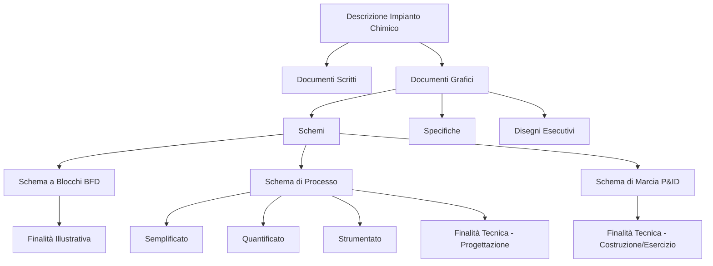

Certamente. Ecco il testo integrale con la parte corretta e ampliata, mantenendo lo stile e le sezioni già corrette.

---

# La Rappresentazione degli Impianti Chimici: Schemi, Specifiche e Disegni Esecutivi

## 📋 Mappa Concettuale del Percorso



## 1. Il Problema di Fondo: Perché Servono gli Schemi?

La progettazione e realizzazione di un impianto chimico è un'operazione complessa che coinvolge **risorse umane e materiali notevoli**. Il passaggio dal laboratorio alla produzione industriale richiede:

1. **Studio preliminare in laboratorio** per raccogliere dati cinetici e termodinamici
2. **Sviluppo in impianti pilota** per validare il processo su scala intermedia
3. **Studio globale di progettazione** che integri aspetti produttivi, finanziari, logistici, costruttivi

> 💡 **Intuizione & Senso Fisico:** Gli elaborati grafici sono il **linguaggio universale** che traduce i calcoli di progettazione in informazioni condivisibili tra chimici, ingegneri, costruttori e operatori. Senza una rappresentazione standardizzata, ogni fase del ciclo di vita dell'impianto (allestimento, collaudo, esercizio) sarebbe fonte di errori e incomprensioni.

## 2. Tassonomia dei Documenti Grafici

I documenti grafici si suddividono in **tre categorie fondamentali**, con complessità e livello di dettaglio crescenti:

| Categoria | Funzione | Contenuto |
|-----------|----------|-----------|
| **Schemi** | Realizzazione pratica del processo | Apparecchiature, collegamenti, controllo |
| **Specifiche** | Descrizione caratteristica dell'apparecchiatura | Materiale, tenuta, norme di collaudo |
| **Disegni esecutivi** | Indicazioni dettagliate per la costruzione | Planimetrie, disegni elettrici, opere civili |

> ⚠️ **Attenzione / Errore Tipico d'Esame:** Confondere la **finalità** dei diversi documenti. Gli schemi rispondono a "come funziona il processo", le specifiche a "come è fatta l'apparecchiatura", i disegni esecutivi a "come si costruisce l'impianto". Sono documenti complementari, NON intercambiabili.

## 3. Gli Schemi di Impianto: Gerarchia e Livelli di Dettaglio

### 3.1 Schema a Blocchi (Block Flow Diagram, BFD)

> 📌 **Definizione Rigorosa:** È la **prima rappresentazione grafica** di un processo chimico. Mostra la **successione delle fasi o stadi fondamentali** del ciclo operativo, senza fornire il numero esatto degli apparecchi né delinearne il tipo.

**Caratteristiche fondamentali:**
- **Serie di rettangoli** (o cerchi) con indicato il nome della trasformazione
- **Correnti** indicate come linee continue con frecce terminali (streams: alimentazione, prodotto/i)
- **Almeno 2 sezioni** (es. reazione, separazione)
- **Almeno 2 flussi materiali**: dall'esterno e verso l'esterno
- **Non necessita di simboli unificati**
- Può essere **quantificato** con i flussi quantitativi di materie e prodotti (primo bilancio generale)

**Finalità:** Illustrativa — fornisce una visione d'insieme immediata del processo.

---

### 3.2 Schema di Processo

> 📌 **Definizione Rigorosa:** Schema con **finalità tecnica** che consente la progettazione. Secondo le norme UNICHIM, nella versione più completa contiene:
> - Le **apparecchiature principali**
> - Le **linee di processo** (non quelle secondarie)
> - La **strumentazione più significativa**
> - Il **bilancio dei materiali** (preferibilmente su foglio allegato)
> - Gli **indici di stato fisico** (T, P) nei punti principali
> - Eventuale **elevazione minima** delle apparecchiature
> - Annotazioni utili per il **montaggio**

**Livelli di dettaglio progressivi:**

| Livello | Contenuto Aggiuntivo | Scopo |
|---------|---------------------|-------|
| **1. Semplificato** | Servizi (acqua fredda, vapore) con linee continue | Visione del processo |
| **2. Quantificato** | Valori di portata, stato fisico, pressione in tabella | Bilanci di materia |
| **3. Strumentato** | Strumentazione completa con cerchi collegati alle linee | Sistema di controllo |

---

### 3.3 Schema di Marcia (Piping and Instrumentation Diagram, P&ID)

> 📌 **Definizione Rigorosa:** Schema d'impianto **completo e più dettagliato** di quello di processo. È il **documento principale** che fornisce le indicazioni per **costruzione, avviamento ed esercizio** dell'impianto.

**Contenuti obbligatori:**
- **Apparecchiature** con sigla, funzione ed eventuale elevazione minima
- **Linee fluidi** di processo e di servizio (acqua, vapore, scarichi)
- **Linee ausiliarie**: avviamento, svuotamento, smaltimento prodotti da rilavorare, additivi, spurghi
- **Strumentazione completa**: linee di collegamento, azionamenti, allarmi, controlli
- **Valvole, dispositivi di sicurezza** e quant'altro necessario per la gestione dell'impianto

---

## 4. Specifiche e Disegni Esecutivi

### 4.1 Specifiche (Data Sheet)

> 📌 **Definizione Rigorosa:** Documento che definisce **univocamente le caratteristiche costruttive e funzionali** di una singola apparecchiatura. È il ponte tra il calcolo di progetto e la costruzione del componente.

**Contenuti tipici di un foglio di specifica:**
- **Dati di targa**: sigla, descrizione, servizio
- **Dati di processo**: fluidi, portate, temperature, pressioni di esercizio e di progetto
- **Dati costruttivi**: materiali, dimensioni, spessori, tipo di costruzione
- **Norme di riferimento**: standard di costruzione e collaudo (es. UNICHIM, ASME)
- **Accessori e dispositivi di sicurezza** richiesti

**Esempio pratico:** Per una **colonna a piatti forati** (Sieve-Tray Column), il foglio di specifica (Data Sheet) riporta: numero di piatti, spaziatura, diametro, materiale, pressione e temperatura di progetto, portate di alimentazione e prodotti, tipo di flusso (cross-flow, controcorrente), dimensioni dei fori e stramazzi.

---

### 4.2 Disegni Esecutivi

> 📌 **Definizione Rigorosa:** Elaborati grafici che forniscono le **indicazioni dettagliate per la costruzione fisica** dell'impianto o di sue parti. Comprendono planimetrie, layout, disegni di dettaglio meccanico, opere civili, impianti elettrici e di servizio.

**Tipologie principali:**
- **Planimetria generale**: disposizione delle aree, degli edifici e delle unità di processo
- **Layout di dettaglio**: posizione esatta di apparecchiature, linee, valvole e piattaforme
- **Disegni meccanici**: particolari costruttivi di recipienti, scambiatori, colonne
- **Disegni civili**: fondazioni, strutture, fabbricati
- **Disegni elettrici e strumentali**: percorsi cavi, quadri, cablaggi

---

## 5. Simbologia e Sigle delle Apparecchiature

La corretta lettura e stesura degli schemi richiede la conoscenza della **simbologia standardizzata** (norme UNICHIM). Di seguito le principali categorie:

### 5.1 Sigle Principali (UNICHIM)

| Sigla | Apparecchiatura | Sigla | Apparecchiatura |
|-------|-----------------|-------|-----------------|
| **D** | Serbatoi | **E** | Scambiatori di calore |
| **G** | Pompe | **P** | Compressori |
| **PJ** | Eiettori | **C** | Colonne |
| **PV** | Vagli | **PM** | Mulini |
| **PF** | Filtri | **PC** | Centrifughe |
| **T** | Trasportatori | **PD** | Dosatori |
| **B** | Forni | | |

### 5.2 Simboli Grafici per Categoria

- **Serbatoi (D)**: rappresentati come rettangoli o cilindri; il tetto (fisso, mobile, a membrana) è indicato con tratti specifici.
- **Pompe (G), Compressori (P), Eiettori (PJ)**: le pompe centrifughe sono cerchi con triangolo interno; i compressori sono cerchi con linea spezzata; gli eiettori hanno una forma a imbuto stilizzata.
- **Colonne (C), Vagli (PV)**: le colonne sono rettangoli verticali con indicazione del tipo di interni (piatti, impaccamento); i vagli sono rettangoli con linee orizzontali.
- **Mulini (PM), Filtri (PF), Centrifughe (PC)**: simboli specifici che richiamano la forma o il principio di funzionamento (es. mulino a sfere, filtro a tamburo).
- **Trasportatori (T) e Dosatori (PD)**: nastri trasportatori con rulli, coclee, dosatori a vite.
- **Scambiatori (E) e Forni (B)**: gli scambiatori a fascio tubiero sono cerchi con linee interne; i forni sono rettangoli con bruciatori stilizzati.

### 5.3 Fluidi di Servizio e Processo

Le linee dei fluidi sono differenziate per tipo di tratteggio e spessore:
- **Linea di processo**: tratto continuo, spessore maggiore
- **Linea di servizio (acqua, vapore, aria)**: tratto continuo, spessore minore
- **Linea futura o esistente**: tratteggio specifico
- **Linea interrata**: tratteggio con punti

### 5.4 Valvole e Strumentazione

- **Valvole**: il simbolo varia in base al tipo (a saracinesca, a globo, a sfera, a farfalla, di non ritorno, di sicurezza). Il comando (manuale, pneumatico, elettrico) è indicato con una lettera o un simbolo aggiuntivo.
- **Strumenti**: rappresentati da un **cerchio** (o ovale) diviso in due parti. La parte superiore indica la **funzione** (es. T = Temperatura, P = Pressione, L = Livello, F = Portata), la parte inferiore la **sigla dell'anello di controllo** (es. TIC = Temperatura Indicatore e Controllore).

---

## 6. Esempi Pratici e Casi di Studio

### 6.1 Esempio di Schema a Blocchi (BFD) con Assorbimento, Stripping e Separazione

Un processo tipico di purificazione di una corrente gassosa può essere rappresentato come:

```
[Alimentazione Gas] --> [Assorbimento] --> [Liquido ricco] --> [Stripping] --> [Gas purificato]
                          |                                                       |
                          +--> [Solvente rigenerato] <---------------------------+
```

### 6.2 Esempio di Schema di Processo Strumentato (P&ID) per Controllo di Livello

**Senza controllo:** Un serbatoio (D-01) riceve un liquido da una pompa (G-01) e lo scarica tramite una valvola manuale. Il livello varia in base ai flussi in ingresso e uscita.

**Con controllo:** Un trasmettitore di livello (LT) sul serbatoio (D-01) invia un segnale a un controllore (LIC) che regola l'apertura di una valvola di controllo (LV) sulla linea di uscita. Questo forma un **anello (loop) di controllo** che mantiene il livello al valore desiderato.

### 6.3 Esempio di Foglio di Specifica per Colonna a Piatti Forati

| Parametro | Valore |
|-----------|--------|
| **Sigla** | C-01 |
| **Servizio** | Separazione propano/propilene |
| **Diametro interno** | 1.2 m |
| **Altezza totale** | 18 m |
| **Numero di piatti** | 40 |
| **Spaziatura piatti** | 0.45 m |
| **Tipo di piatto** | Forato (sieve tray) |
| **Diametro fori** | 5 mm |
| **Pressione di progetto** | 20 bar |
| **Temperatura di progetto** | 80 °C |
| **Materiale** | Acciaio al carbonio |
| **Norma di costruzione** | ASME VIII Div.1 |

### 6.4 Planimetria Generale di una Raffineria

La planimetria di una raffineria mostra la disposizione delle diverse unità (distillazione, reforming, desolforazione), i serbatoi di stoccaggio, le aree di carico/scarico, le torri di raffreddamento e le zone di sicurezza. La distanza tra le unità è regolata da normative per prevenire il rischio di incidenti.

---

## 7. Riepilogo e Concetti Chiave

> ✅ **Concetti Fondamentali per l'Esame:**
> 1. **BFD**: visione d'insieme, finalità illustrativa.
> 2. **Schema di Processo**: finalità tecnica, progettazione, tre livelli (semplificato, quantificato, strumentato).
> 3. **P&ID**: documento completo per costruzione ed esercizio.
> 4. **Specifiche**: definiscono l'apparecchiatura (Data Sheet).
> 5. **Disegni esecutivi**: dettagli costruttivi e planimetrie.
> 6. **Simbologia UNICHIM**: linguaggio standard per la comunicazione tecnica.
> 7. **Anello di controllo**: combinazione di misura, controllo e valvola finale per la regolazione automatica.