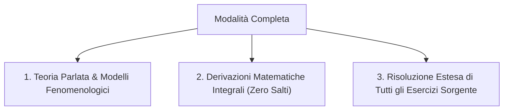

# PROTOCOLLO: MODALITÀ COMPLETA (DISPENSA MAGISTRALE)
**Trattazione Accademica Integrale per Appunti di Corso, Slide e Dispense**

---

## 1. Scopo della Modalità Completa
La modalità **Completa** (`mode: 'complete'`) è concepita per produrre il testo di studio di riferimento definitivo a partire da dispense del docente, sbobinature di lezioni universitarie o slide PowerPoint.

A differenza della *Sintesi Accademica* (che comprime la ridondanza dei libri per lo studio veloce pre-esame), la modalità Completa mira alla **massima ampiezza didattica ed espositiva**, fornendo tutto il supporto discorsivo necessario affinché lo studente non debba consultare nessun'altra fonte esterna.

---

## 2. I Tre Pilastri della Trattazione Completa

### 1. Teoria Parlata & Comprensione Qualitativa:
* Dedica ampio spazio alla spiegazione discorsiva dei fenomeni (*"cosa sta succedendo fisicamente o logicamente"*).
* Introduce ogni grandezza rispondendo alle 6 domande del Modus Operandi (perché ne parliamo, significato, rappresentazione fisica, formula/unità, ruolo nel calcolo, limiti di validità).
* Fornisce allo studente il lessico e le argomentazioni orali necessarie per sostenere con sicurezza l'esame con il docente.

### 2. Derivazioni Matematiche Punto per Punto:
* Nessun passaggio algebrico, analitico o geometrico viene dato per scontato.
* Ogni dimostrazione si apre con la dichiarazione di *Ipotesi* e *Tesi*, prosegue con la catena delle trasformazioni matematiche esplicite e si chiude con l'interpretazione dei risultati e l'analisi dei casi limite.

### 3. Risoluzione di Tutti gli Esercizi del Materiale:
* Se il materiale sorgente contiene 5 problemi o quesiti, la modalità Completa li svolge **tutti e 5 per intero**, senza tralasciarne alcuno.
* Ogni esercizio è strutturato come un percorso didattico autonomo: consegna originale, dati/incognite, schema mentale preliminare, calcoli algebrici espliciti, risposta con unità SI e verifiche di coerenza.

---

## 3. Quando Utilizzare la Modalità Completa
* Quando studi da slide o appunti presi a lezione che necessitano di essere "completati" con tutta la teoria parlata e le dimostrazioni che il professore ha spiegato a voce.
* Quando intendi stampare o esportare una dispensa monografica permanente da ripassare sia per lo scritto che per l'orale.
