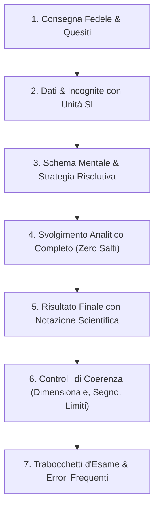

# PROTOCOLLO: LE MODALITÀ DI FOCUS DIDATTICO
**Focus Teoria & Dimostrazioni vs Focus Eserciziario Guidato**

---

## 1. Introduzione alle Modalità di Focus
StudyGenius permette di specializzare verticalmente la generazione verso la tipologia di prova d'esame da affrontare:
* Per l'**Esame Orale** $\longrightarrow$ **Focus Teoria & Dimostrazioni** (`mode: 'theory'`)
* Per la **Prova Scritta** $\longrightarrow$ **Focus Eserciziario Guidato** (`mode: 'exercises'`)

---

## 2. Focus Teoria & Dimostrazioni (`theory`)
Questa modalità massimizza la profondità concettuale, l'interpretazione critica e la difesa delle ipotesi.

### Standard Operativo:
1. **Teoria Parlata Approfondita:** Tratta ogni argomento con spiegazioni discorsive ricche di significato qualitativo, descrivendo il comportamento del sistema e l'origine causale delle leggi.
2. **Struttura Formale delle Dimostrazioni:**
   Ogni dimostrazione viene formattata come un blocco logico autosufficiente:
   * **Ipotesi ($H$):** Tutte le condizioni necessarie;
   * **Costruzione Logica:** L'idea guida della dimostrazione (diretta, per assurdo, ecc.);
   * **Tesi ($Th$):** L'enunciato da provare;
   * **Passaggi Analitici Espliciti:** Esplicitazione di ogni derivata, integrale o manipolazione;
   * **Conclusione ($\blacksquare$):** Chiusura formale.
3. **Studio Sistematico dei Controesempi:**
   Per ogni teorema, il testo mostra cosa accade se viene violata una delle ipotesi, preparando lo studente alle classiche domande "a trabocchetto" dell'esame orale.

---

## 3. Focus Eserciziario Guidato (`exercises`)
Questa modalità trasforma gli appunti o le dispense in un eserciziario d'esame ad alta risoluzione operativa.

### Il Protocollo in 7 Passi per ogni Esercizio:
Ogni problema presente nel testo sorgente viene svolto applicando categoricamente i 7 passi:

1. **Consegna Integrale Fedele:** Mantiene fedelmente testo, numerazione e quesiti separati (punto 1, 2, 3 o a, b, c).
2. **Dati e Incognite:** Riconosce e tabula tutti i dati noti e le quantità richieste, associando a ciascuna la corretta unità di misura SI.
3. **Schema Mentale & Strategia Risolutiva:** Spiega a parole *perché* si sceglie una determinata legge fisica/matematica o un certo metodo analitico prima di scrivere la prima formula di calcolo.
4. **Svolgimento Analitico Completo:** Mostra tutti i passaggi algebrici senza omettere passaggi intermedi, con sostituzione numerica finale.
5. **Risultato Finale Identificabile:** Evidenziato chiaramente con unità di misura SI (es. $\boxed{v = 4.90 \times 10^3\text{ m/s}}$).
6. **Controlli di Coerenza:**
   * *Controllo Dimensionale:* Verifica che le dimensioni fisiche del risultato corrispondano a quelle dell'incognita;
   * *Controllo del Segno:* Coerenza con il sistema di coordinate scelto;
   * *Controllo del Limite:* Verifica del comportamento per valori estremi dei parametri.
7. **Trabocchetti d'Esame:** Mette in guardia lo studente dall'errore concettuale o di calcolo tipicamente commesso dagli studenti su quel problema.
