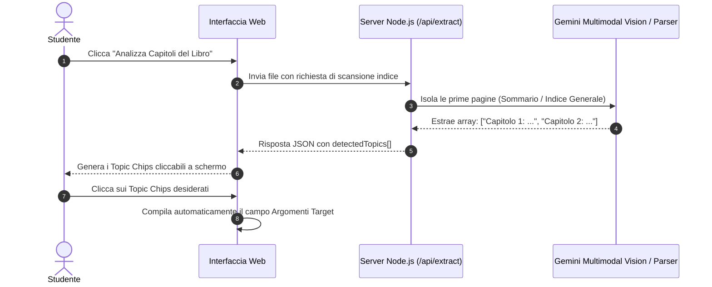

# PROTOCOLLO: FOCUS ASSISTITO & ANALISI CAPITOLI
**Riconoscimento Automatico dell'Indice e Selezione Interattiva dei Capitoli**

---

## 1. Il Problema che Risolve
Quando uno studente carica un manuale universitario da 500–800 pagine in formato PDF, spesso non ricorda a memoria la suddivisione esatta dei capitoli del testo, oppure trova noioso digitare manualmente nel riquadro di ricerca titoli lunghi e articolati.

Il **Focus Assistito** automatizza completamente questo passaggio: permette di scansionare l'indice del libro in pochi secondi e di selezionare i capitoli d'esame con un semplice clic.

---

## 2. Come Funziona il Pulsante "🔍 Analizza Capitoli del Libro"



---

## 3. Flusso Tecnico Dettagliato
1. **Scansione Rapida Mirata:**
   - Il motore non elabora le 600 pagine del manuale, ma individua le pagine di testa dove risiede l'indice generale (*Table of Contents*) o i lucidi di agenda nelle slide PowerPoint.
   - Viene invocato Gemini Vision per estrarre la gerarchia dei capitoli e dei paragrafi principali.
2. **Generazione dei Topic Chips Dinamici:**
   - Nel riquadro compare una griglia di chip interattivi:
     ```text
     [ 1. Cinematica del Punto ]   [ 2. Dinamica Newtoniana ]   [ 3. Lavoro ed Energia ]
     [ 4. Moti Centrali e Gravità ] [ 5. Sistemi di Punti ]     [ 6. Corpo Rigido ]
     ```
3. **Interazione One-Click:**
   - Cliccando su un chip, questo si illumina e il suo nome viene aggiunto istantaneamente al campo `target-topics-input`.
   - Cliccando di nuovo, il chip si deseleziona e viene rimosso dall'elenco.
   - Il tasto **"Tutti gli argomenti"** seleziona istantaneamente l'intero sommario se si desidera coprire l'intero libro.

---

## 4. Vantaggi per lo Studente
* **Zero Errori di Digitazione:** Il nome dei capitoli coincide perfettamente con le intestazioni presenti nel libro, massimizzando l'efficacia del motore di filtraggio.
* **Velocità:** In meno di 10 secondi lo studente ha a disposizione l'intera mappa del libro pronta per essere filtrata.
