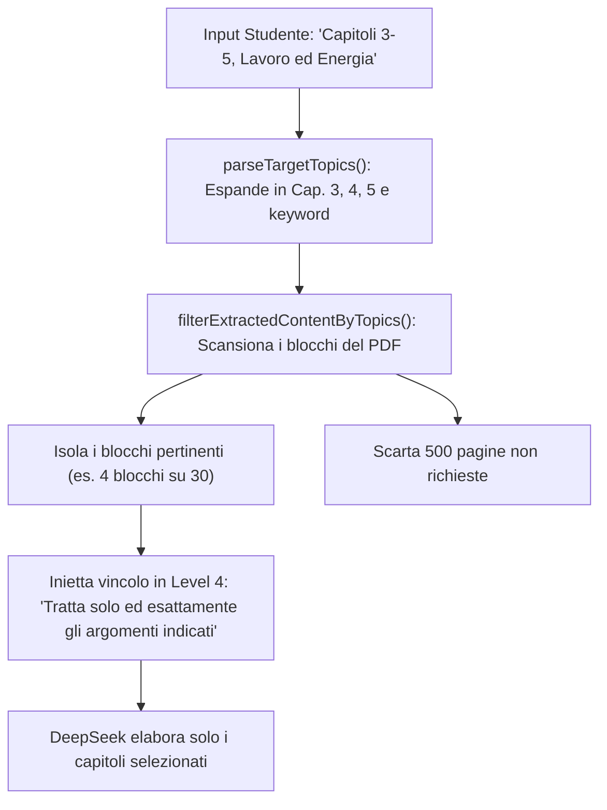

# PROTOCOLLO: INSERIMENTO DI UN ARGOMENTO (SCOPE MIRATO)
**Cosa succede quando indichi uno o più argomenti/capitoli specifici**

---

## 1. Visione d'Insieme
Quando inserisci un argomento o un elenco di capitoli nel campo:
$$\mathbf{\text{“🎯 Argomenti o Capitoli da Trattare (Scope Mirato)”}}$$
il sistema attiva il motore di scope intelligente **`src/services/scopeService.js`**.

Questo meccanismo impedisce che un libro di 600 pagine venga trascritto per intero, isolando chirurgicamente solo i capitoli che devi portare all'esame.

---

## 2. Tipologie di Input Riconosciute Automaticamente
Il parser regex di `scopeService.js` riconosce qualunque stile di scrittura:
1. **Intervalli e Range Numerici:**
   - Scrivendo *"capitoli dal 3 al 6"*, *"capitoli 3-6"*, *"da 2 a 5"*, il sistema espande automaticamente la richiesta in `Capitolo 3`, `Capitolo 4`, `Capitolo 5`, `Capitolo 6`.
2. **Capitoli Singoli o Multipli:**
   - *"Cap. 2"*, *"Capitolo 4"*, *"Parte 1"*, *"Capitoli 2, 7 e 9"*.
3. **Parole Chiave Concettuali:**
   - *"Riclassificazione di Bilancio, Indici di Redditività, EBITDA, ROI"*
   - *"Equazioni di Maxwell, Potenziale Vettore, Onde TEM"*
   - Termini separati da virgole, punto e virgola o congiunzioni *"e"*.

---

## 3. Cosa Succede sotto il Cofano (Fase per Fase)

### Fase 1: Parsing e Tokenizzazione (`parseTargetTopics`)
La stringa inserita viene trasformata in una collezione di descrittori semantici categorizzati per tipo (`chapter` con numero associato, oppure `keyword`).

### Fase 2: Segmentazione e Filtraggio Chirurgico (`filterExtractedContentByTopics`)
* Il testo completo estratto dal PDF o PPTX viene segmentato in blocchi e moduli tematici in corrispondenza di titoli, intestazioni e cambi di capitolo.
* Il motore confronta ogni blocco con i criteri dello studente:
  * Se un blocco corrisponde a un capitolo o a una parola chiave richiesta, viene mantenuto.
  * Se un blocco riguarda capitoli esclusi (es. il capitolo 1 e 2 quando hai chiesto dal 3 in poi), **viene scartato integralmente**.
* Nel terminale e nell'interfaccia appare la notifica in tempo reale:  
  `⚡ Filtro argomenti attivo: isolati X blocchi pertinenti su Y totali`.

### Fase 3: Vincolo Tassativo nel System Prompt (Livello L4)
Il compilatore di prompt inietta un'istruzione imperativa non derogabile:
> **"Focalizzazione Rigorosa sugli Argomenti Richiesti:**  
> Tratta solo ed esattamente gli argomenti indicati dallo studente. Non divagare su argomenti o capitoli esclusi. Dedica l'intera ampiezza del modello ai soli argomenti selezionati."

---

## 4. Perché questa Funzione è Fondamentale
* **Risparmio Enorme di Tempo:** Invece di attendere la generazione di un'intera enciclopedia, ottieni la tua dispensa mirata in pochi minuti.
* **Massima Profondità:** L'intelligenza artificiale concentra l'intero budget di token ed elaborazione solo sui concetti che ti verranno chiesti all'esame, evitando di disperdere l'attenzione su parti che non devi studiare.
