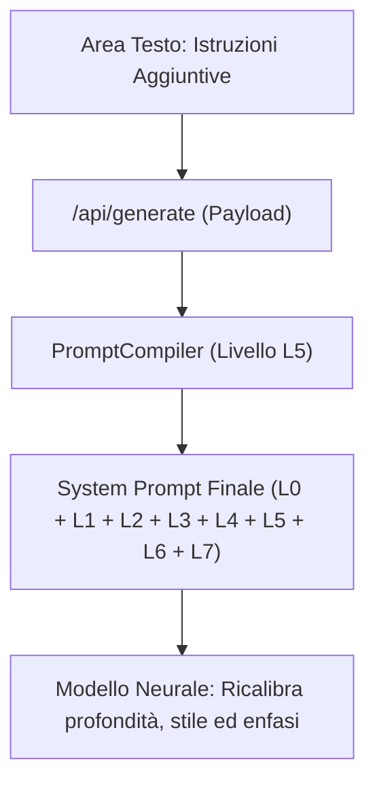

# PROTOCOLLO: ISTRUZIONI AGGIUNTIVE
**Cosa succede quando inserisci un'istruzione personalizzata nel riquadro testo**

---

## 1. Visione d'Insieme
Nel riquadro:
$$\mathbf{\text{“✏️ Istruzioni aggiuntive (opzionale)”}}$$
puoi dialogare direttamente con il compilatore didattico di StudyGenius prima di avviare la generazione.

Questo campo serve a personalizzare la dispensa secondo le preferenze specifiche del tuo docente universitario o le tue esigenze individuali di apprendimento.

---

## 2. Percorso Tecnico dell'Istruzione (Iniezione nel Livello L5)
Quando clicchi su *"Genera Riassunto"*:
1. Il client trasmette il testo delle istruzioni a `orchestratorService.js` tramite payload JSON.
2. L'orchestratore passa la stringa al `PromptCompiler` (`src/core/promptCompiler.js`).
3. Il compilatore inserisce il testo nel **`LEVEL 5: CONTESTO DELLO STUDENTE E PERSONALIZZAZIONE`**, formattandolo come direttiva primaria di sessione:
   ```markdown
   ### Istruzioni Aggiuntive per Questa Sessione:
   [Il testo esatto inserito dallo studente]
   ```
4. Il modello neurale (DeepSeek / Gemini) riceve questa sezione con **priorità applicativa immediata**.



---

## 3. Gerarchia delle Regole: Cosa Può e Non Può Fare
* **Cosa PUÒ fare l'istruzione:**
  * **Modificare il focus:** Concentrare la dispensa su un argomento specifico (es. *"Dai massimo spazio al ciclo di Carnot e alle macchine termiche"*);
  * **Imporre notazioni specifiche:** Scegliere simboli preferiti dal tuo docente (es. *"Usa la convenzione IUPAC per il lavoro: $W < 0$ se fatto sull'ambiente"*, *"Usa coordinate polari anziché cartesiane"*);
  * **Richiedere materiale d'esame supplementare:** *"Aggiungi 3 esercizi complessi di livello d'esame risolti con tutti i passaggi"*;
  * **Enfatizzare la preparazione orale:** *"Aggiungi domande tipiche d'esame con risposta argomentata per difendere le ipotesi all'orale"*.
* **Cosa NON PUÒ fare (Invarianti di Livello 0):**
  * Un'istruzione aggiuntiva non può ordinare al modello di falsificare la scienza o di scrivere equazioni matematicamente errate;
  * Non può costringere il modello a saltare passaggi matematici obbligatori o a usare formule senza storia (il protocollo Anti-Black-Box di Livello 7 rimane sempre attivo).

---

## 4. Esempi Pratici di Istruzioni Efficaci
| Istruzione Inserita dallo Studente | Effetto Didattico Prodotto nella Dispensa |
| :--- | :--- |
| *"Il professore insiste molto sulle condizioni di validità del Teorema di Gauss."* | Il sistema genera callout semantici dedicati (`> ⚠️`) spiegando cosa accade se la superficie non è chiusa o se la simmetria non consente di portare $\vec{E}$ fuori dall'integrale. |
| *"Fai tutti i passaggi matematici dell'integrazione per parti senza saltare le costanti."* | Il modello esplicita la derivata di $f(x)$, la primitiva di $g'(x)$, il termine di bordo e l'integrale residuo passaggio per passaggio. |
| *"Spiega come riconoscere quando usare Thevenin rispetto a Norton."* | Viene inserito uno schema mentale comparativo (`> 🧠`) con la checklist decisionale per scegliere il circuito equivalente più rapido durante l'esame scritto. |
