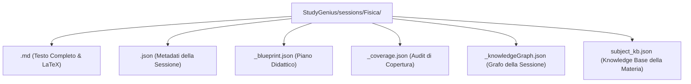

# PROTOCOLLO: DOVE E COME VENGONO SALVATE LE SESSIONI
**Struttura del Filesystem, Architettura di Persistenza e Gestione dei Dati**

---

## 1. Percorso Esatto nel Filesystem
Tutte le sessioni generate da StudyGenius vengono salvate **in locale sul tuo computer**, garantendo massima privacy e persistenza permanente dei tuoi appunti.

La directory di salvataggio è:
$$\mathbf{\text{StudyGenius/sessions/<NomeMateria>/}}$$
*(ad esempio: `StudyGenius/sessions/Fisica/`, `StudyGenius/sessions/Chimica/`, `StudyGenius/sessions/Matematica/`, ecc.)*

---

## 2. Anatomia dei File di Sessione
Per ogni sessione creata, il sistema non salva solo un semplice testo, ma una **suite completa di file ingegneristici**:

| Nome File | Scopo e Contenuto Specifico |
| :--- | :--- |
| **`<sessionId>.md`** | **Il testo completo della dispensa.** Contiene tutti i capitoli, le definizioni formali, le formule matematiche in LaTeX inline e display, i box semantici (`> 📌`, `> 💡`, `> ⚠️`) e i diagrammi. È leggibile con qualsiasi editor Markdown (Obsidian, VS Code, Typora). |
| **`<sessionId>.json`** | **I metadati completi.** Contiene: `id` (UUID univoco), `title` (titolo assegnato alla sessione), `subject` (materia), `studyMode` (modalità adottata), `createdAt` e `updatedAt` (timestamp ISO), `wordCount` (conteggio parole), `targetTopics` (argomenti mirati), `customInstructions` (istruzioni aggiuntive) e l'elenco dei file PDF/PPTX originari caricati. |
| **`<sessionId>_blueprint.json`** | **Il Blueprint didattico.** Rappresenta la mappa di progettazione: sequenza logica dei capitoli, dipendenze concettuali, formule cardine da evidenziare e nodi del grafo associati. |
| **`<sessionId>_coverage.json`** | **La Coverage Matrix.** Matrice di audit che certifica che nessun argomento presente nel materiale d'origine sia stato omesso durante la sintesi. |
| **`<sessionId>_knowledgeGraph.json`** | **Il Grafo di Conoscenza Locale.** Contiene l'elenco dei nodi (concetti, definizioni, formule) e degli archi semantici (*dipende_da, estende, applica, confuta*) utilizzati per generare la mappa concettuale interattiva a schermo intero. |
| **`subject_kb.json`** | **La Knowledge Base Persistente della Materia.** File condiviso da tutte le sessioni della stessa disciplina. Conserva definizioni canoniche e assiomi già spiegati in passato per garantire che il lessico e le definizioni rimangano coerenti nel tempo tra una sessione e l'altra! |

---

## 3. Gestione e Operazioni sulle Sessioni

### Salvataggio Automatico:
Non c'è bisogno di cliccare "Salva". Non appena la generazione termina con successo, il server scrive atomicamente tutti i file su disco.

### Ridenominazione Istantanea del Titolo:
Se modifichi il titolo della sessione nel campo in alto (`session-title-input`) e sposti il focus (evento `blur`), il sistema invia una richiesta `PATCH` al server, aggiornando istantaneamente il file `.json` su disco e la voce nella colonna laterale sinistra.

### Ricaricamento dalla Sidebar:
Cliccando su qualsiasi sessione elencata nella barra laterale sinistra:
1. Il client chiama l'endpoint `GET /api/sessions/:id`.
2. Il server legge il file `.md` e il file `.json` e li invia al browser.
3. Il frontend renderizza all'istante il testo con MathJax, aggiorna i contatori e imposta la materia corretta.

### Tasto "⏩ Continua Dispensa":
Quando apri una sessione salvata in precedenza, compare in alto il pulsante **"Continua Dispensa"**: ti consente di caricare un nuovo PDF o nuovi appunti ed espandere la dispensa esistente aggiungendo nuovi capitoli senza ripartire da zero.

### Eliminazione Sicura:
Cliccando sull'icona cestino (`🗑️`) accanto alla sessione nella sidebar, viene inviata una chiamata `DELETE /api/sessions/:id`. Il server rimuove in sicurezza tutti i file associati a quell'ID dalla cartella della materia.

---

## 4. Esportazione Esterna
Da ogni sessione puoi generare:
1. **`.md`**: Scarica direttamente sul tuo computer il file Markdown pronto per Obsidian, Notion o GitHub.
2. **`📥 Scarica PDF`**: Il server avvia un'istanza headless di Chromium (Puppeteer) che trasforma la sessione in un **documento PDF editoriale A4 ad alta risoluzione**, completo di frontespizio accademico, numeri di pagina, formule vettoriali e box didattici colorati.
