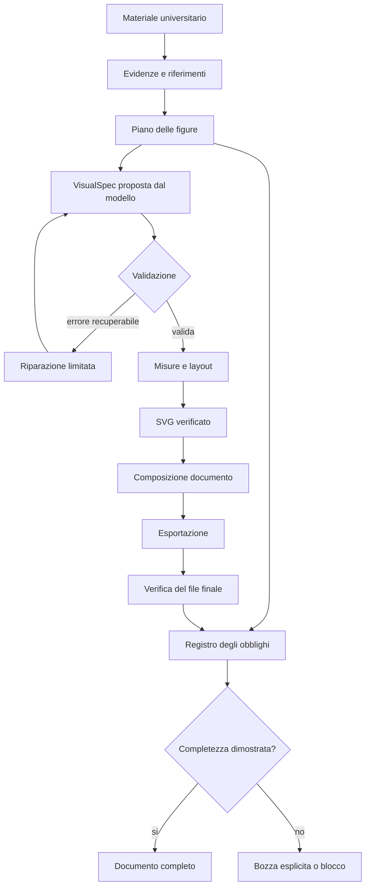

# StudyGenius — Scientific Visual Compiler

## Specifica tecnica per SVG scientifici affidabili, leggibili e realmente presenti nei documenti

**Destinatario:** Google Antigravity, come agente incaricato di migliorare StudyGenius.

**Versione:** 1.0 — 9 settembre 2026.

**Obiettivo:** trasformare la produzione delle figure scientifiche in un processo controllato, verificabile e recuperabile: dalla comprensione del materiale universitario fino alla presenza effettiva delle figure nel documento consegnato.

**Natura del documento:** specifica architetturale e operativa. Non descrive modifiche già applicate al repository.

**Limite dell’analisi iniziale:** sono disponibili la descrizione del sistema e uno screenshot, non il repository StudyGenius, i suoi log o il documento HTML/PDF originale. Le possibili cause del problema sono quindi ipotesi da verificare, non diagnosi già dimostrate.

---

## 1. Il cambiamento fondamentale: non un generatore di SVG, ma un compilatore visivo

La divisione attuale proposta da Antigravity contiene un principio valido:

- il modello IA interpreta il contenuto e descrive che cosa rappresentare;
- il codice locale traduce quella descrizione in geometria e markup SVG.

Questa separazione deve rimanere.

Tuttavia, da sola non basta. Un renderer deterministico può produrre, in maniera perfettamente ripetibile, una figura sbagliata, illeggibile, vuota oppure mai inserita nel documento finale.

StudyGenius dovrebbe quindi adottare un’architettura da **compilatore visivo scientifico**.

Il percorso completo diventa:

1. acquisire il materiale e conservarne le evidenze;
2. decidere quali figure servono realmente;
3. creare un contratto semantico per ogni figura;
4. validarne struttura, riferimenti e contenuto verificabile;
5. calcolare testo, formule, geometria e layout;
6. produrre l’SVG;
7. verificarne integrità, sicurezza e resa;
8. inserirlo nel documento;
9. esportare il documento;
10. verificare che la figura sia presente e leggibile nel file effettivamente consegnato.

Il sistema non deve considerare il lavoro concluso al punto 6.

### 1.1 La regola centrale

> Una figura non è riuscita quando è stata richiesta, quando esiste un JSON o quando il renderer ha restituito una stringa. È riuscita quando soddisfa il proprio contratto ed è stata verificata nella destinazione finale richiesta.

Questa regola deve diventare una condizione tecnica del programma, non una semplice raccomandazione nel prompt.

### 1.2 Che cosa correggere nella spiegazione precedente

| Affermazione | Formulazione corretta | Conseguenza |
| --- | --- | --- |
| «Un renderer locale non può sbagliare sintassi» | Un serializer strutturato riduce gli errori, ma implementazione e trasformazioni possono essere difettose | Riparsare e validare il risultato |
| «Il JSON garantisce la correttezza» | La validità del JSON non dimostra la correttezza scientifica | Separare schema e semantica |
| «Il renderer ha generato l’SVG» | L’SVG potrebbe non essere visibile o non arrivare nell’esportazione | Verificare l’intero percorso |
| «Il disegno locale costa sempre pochissimo» | Costo e latenza dipendono da layout, formule, font e controlli | Misurare, senza promesse arbitrarie |
| «Tutti i grafici avranno lo stesso stile» | Uno stile condiviso richiede regole centralizzate e test | Introdurre un tema versionato |

### 1.3 Una promessa realistica di affidabilità

Non dichiarare che il sistema sia matematicamente infallibile per qualsiasi documento.

Costruire invece garanzie concrete:

- nessuna figura attesa scompare silenziosamente;
- nessuna figura fallita viene dichiarata riuscita;
- nessun dato viene inventato per completare un disegno;
- nessun errore scientifico viene nascosto da un fallback grafico;
- ogni risultato è riconducibile a fonti, specifica, renderer e verifiche;
- ogni guasto ha uno stato esplicito e una procedura di recupero;
- un documento incompleto viene riconosciuto come tale.

Il comportamento desiderato è: **errore rilevabile, circoscritto, spiegabile e recuperabile**.

---

## 2. Prima attività: trovare dove si perdono gli SVG

Nello screenshot, la “Mappa Concettuale del Capitolo” appare come un albero testuale monospaziato dentro un riquadro.

Questa osservazione è compatibile con:

- una mappa mai richiesta come figura;
- un modello che ha prodotto soltanto testo;
- un contratto non riconosciuto;
- un renderer non invocato;
- un errore di rendering;
- un fallback testuale;
- una perdita durante composizione o esportazione.

Lo screenshot non permette di scegliere una di queste cause.

### 2.1 Individuare il primo confine rotto

Per una figura identificata da un preciso `visualId`, controllare:

| Fase | Evidenza richiesta |
| --- | --- |
| Pianificazione | La figura compare nel piano? |
| Generazione semantica | Esiste una risposta strutturata per quell’ID? |
| Parsing | La risposta è completa e parsabile? |
| Validazione | Schema e controlli semantici hanno un esito registrato? |
| Dispatch | È stato selezionato un renderer compatibile? |
| Rendering | Esiste un artefatto SVG non vuoto e valido? |
| Sanitizzazione | Gli elementi necessari sono sopravvissuti? |
| Composizione | Il documento contiene un blocco figura collegato all’artefatto? |
| Visualizzazione | La figura ha dimensioni e contenuto visibili? |
| Esportazione | La figura compare nel file finale? |

La diagnosi deve fermarsi al primo passaggio che non mantiene il proprio contratto.

Non correggere contemporaneamente prompt, layout, CSS e PDF senza prima sapere dove avviene la perdita: diventerebbe impossibile attribuire il risultato a una causa.

### 2.2 Problemi concreti da cercare nel repository

Questi sono controlli di ispezione, non bug già accertati:

- il modello genera una mappa dentro un code fence invece di una `VisualSpec`;
- il produttore scrive `visuals`, ma il consumatore legge `diagrams`;
- lo streaming viene elaborato prima della chiusura del JSON;
- un renderer è presente nei sorgenti ma non viene importato nel bundle;
- una funzione asincrona viene invocata senza `await`;
- un `forEach(async ...)` avvia lavori che l’esportazione non aspetta;
- un `catch` restituisce `""`, `null` o testo senza registrare il fallimento;
- un filtro elimina risultati falliti e riduce anche il conteggio delle figure attese;
- l’escaping converte `<svg>` in testo;
- il sanitizzatore rimuove SVG o attributi indispensabili;
- il documento esportato è una copia del DOM ottenuta troppo presto;
- un URL `blob:` viene revocato prima della stampa;
- un percorso relativo viene usato in una pagina `about:blank`;
- formule esportate dipendono da definizioni rimaste altrove;
- più figure condividono ID di marker, clip path o glifi;
- l’SVG ha dimensioni nulle o contenuto fuori dal `viewBox`;
- una cache recupera dati prodotti con uno schema precedente.

### 2.3 La prima prova verticale

Prima di migliorare la qualità estetica, creare una fixture locale composta da:

- un piano con una figura obbligatoria;
- una `VisualSpec` scritta manualmente;
- tre nodi;
- due collegamenti;
- nessuna chiamata IA;
- nessuna dipendenza di rete;
- esportazione attraverso lo stesso percorso usato dalla dispensa.

Questa prova deve attraversare l’intero sistema.

Se fallisce, il problema non richiede un modello più intelligente: esiste un difetto nella pipeline locale.

---

## 3. Architettura proposta



Il ritorno verso il modello è limitato da budget e condizioni di arresto. Non è un ciclo infinito.

### 3.1 Responsabilità dei componenti

| Componente | Responsabilità |
| --- | --- |
| Evidence Collector | Acquisire testo, pagine, crop, tabelle e riferimenti |
| Visual Planner | Decidere obiettivo didattico, famiglia, priorità e posizione |
| Provider Adapter | Gestire richieste e risposte del modello scelto |
| Spec Validator | Controllare schema, versioni, limiti e riferimenti |
| Scientific Validator | Controllare unità, invarianti, calcoli e provenienza verificabile |
| Visual Registry | Esporre i renderer realmente disponibili |
| Text/Math Service | Comporre e misurare testo e formule |
| Layout Engine | Calcolare posizioni, ingombri e percorsi |
| SVG Backend | Serializzare primitive grafiche controllate |
| Artifact Store | Conservare artefatti e metadati |
| Document Composer | Inserire figure tramite riferimenti stabili |
| Export Verifier | Verificare il documento realmente esportato |

Queste sono responsabilità separabili, non dodici microservizi da creare.

In un’applicazione locale possono essere moduli nello stesso processo. Separare i confini logici è più importante che moltiplicare cartelle, processi o dipendenze.

---

## 4. Il materiale deve essere letto anche visivamente

Estrarre testo da un PDF non equivale a leggerne le immagini.

Se StudyGenius invia al modello soltanto una stringa, una curva o uno schema presenti esclusivamente nella pagina grafica non vengono trasmessi come immagine.

Gemini documenta la comprensione visiva dei PDF attraverso i percorsi supportati dell’API. Questo non prova che StudyGenius stia già utilizzando quel percorso: occorre verificare il payload effettivo e le capacità dell’endpoint selezionato. [Google — Document understanding](https://ai.google.dev/gemini-api/docs/document-processing)

### 4.1 Acquisizione su due canali

Prevedere:

**Canale testuale**

- titoli;
- paragrafi;
- didascalie;
- tabelle;
- formule estratte;
- ordine di lettura.

**Canale visivo**

- PDF nativo passato a un modello compatibile; oppure
- pagine renderizzate;
- crop delle regioni rilevanti;
- collegamento con didascalia e testo circostante.

I canali devono condividere gli stessi riferimenti.

Un crop senza gli assi o la didascalia può perdere unità e condizioni. Una didascalia senza la figura può perdere l’informazione principale.

### 4.2 Registro delle evidenze

Ogni evidenza dovrebbe identificare:

- documento sorgente;
- hash del documento;
- pagina;
- numero di pagina visibile, se diverso dall’indice interno;
- intervallo di testo o rettangolo della regione;
- orientamento e trasformazioni;
- modalità di acquisizione;
- versione dell’estrattore;
- limiti di leggibilità;
- collegamenti con altre evidenze.

Gli ID devono essere assegnati dall’applicazione.

Il modello riceve una lista di riferimenti validi e può citarli. Non può inventare una pagina o un identificatore che il programma accetti senza controllo.

### 4.3 Riutilizzo e ricostruzione

Per ogni figura sorgente scegliere consapevolmente fra:

1. riutilizzo dell’originale;
2. ricostruzione da dati o modello noti;
3. ricostruzione delle sole relazioni qualitative;
4. richiesta di revisione perché le informazioni non bastano.

Una curva digitalizzata da un’immagine è una stima. Deve conservare:

- calibrazione degli assi;
- eventuale scala logaritmica;
- risoluzione;
- incertezza;
- limite di precisione.

Non trasformare una lettura approssimata in dati apparentemente esatti.

Non usare immagini generate liberamente da un modello per rappresentare quantità, formule o strutture che devono essere precise.

---

## 5. Pianificare le figure prima di generarle

Introdurre un `VisualPlan` distinto dal testo della dispensa.

Questo oggetto stabilisce che cosa deve esistere alla fine.

Ogni voce contiene almeno:

- `visualId`;
- sezione di destinazione;
- obiettivo didattico;
- famiglia richiesta;
- evidenze;
- priorità `required` oppure `optional`;
- profili di esportazione;
- eventuale vincolo di vettorialità;
- stato del lavoro.

### 5.1 L’utilità precede la quantità

Il planner deve rispondere a quattro domande:

1. quale domanda dello studente risolve la figura?
2. quale relazione mostra meglio di una frase?
3. quali evidenze autorizzano la rappresentazione?
4. quale forma introduce meno ambiguità?

Non imporre una quota cieca di SVG per pagina.

Una definizione isolata può non richiedere una figura. Una classificazione, una curva caratteristica o un processo con ricircolo spesso la richiedono.

### 5.2 Applicazione al capitolo dello screenshot

| Contenuto | Rappresentazione proposta |
| --- | --- |
| Classificazione delle pompe | Mappa gerarchica suddivisa in pannelli leggibili |
| Portata, prevalenza e potenza | Schema annotato con grandezze e legenda |
| Curva della pompa e curva dell’impianto | Grafico cartesiano con intersezione calcolata |
| Serie e parallelo | Schemi affiancati con grafici coerenti |
| Cavitazione e NPSH | Rappresentazione basata sulle definizioni e condizioni della fonte |

Non inserire tutto in una mappa gigantesca.

Una soluzione editoriale più efficace può essere:

- una panoramica breve;
- una figura di classificazione;
- una figura quantitativa;
- uno schema di processo;
- approfondimenti collocati vicino ai paragrafi pertinenti.

Le classificazioni devono seguire la terminologia effettiva del corso, senza correggerla automaticamente sulla base di inferenze del modello.

### 5.3 Il caso delle zero figure

Una pipeline può funzionare per ogni figura ricevuta e produrre comunque zero figure perché il piano è vuoto.

Per evitarlo:

- se l’utente richiede figure e il piano è vuoto, generare `VISUAL_PLAN_EMPTY`;
- se il testo contiene “come mostrato nella figura” senza una figura associata, generare `DANGLING_FIGURE_REFERENCE`;
- se una mappa grafica prevista diventa soltanto testo, l’obbligo resta insoddisfatto;
- se nessuna figura è giustificata, registrare una motivazione verificabile.

Non creare diagrammi ornamentali soltanto per superare un contatore.

---

## 6. Separare i contratti

Non concentrare tutto in un JSON onnipotente.

| Oggetto | Contenuto | Autorità |
| --- | --- | --- |
| `VisualPlan` | Obblighi, priorità e collocazione | Applicazione |
| `VisualSpec` | Entità, relazioni, dati e annotazioni | Proposta del modello, soggetta a validazione |
| `RenderContext` | Dimensioni, tema, font e budget | Applicazione |
| `SceneGraph` | Geometria risolta | Compilatore locale |
| `VisualArtifact` | SVG, hash, dimensioni e prove | Renderer e verificatore |
| `VisualLedger` | Stati, tentativi e completezza | Applicazione |

Il modello non deve poter:

- impostare `verified: true`;
- rendere opzionale una figura obbligatoria;
- scegliere percorsi arbitrari;
- disabilitare controlli;
- decidere che un errore debba essere ignorato;
- certificare autonomamente la correttezza scientifica.

### 6.1 Che cosa scrive il modello

Il modello può scrivere:

- nomi dei concetti;
- relazioni;
- categorie;
- valori numerici supportati;
- unità;
- annotazioni;
- formule tipografiche;
- riferimenti alle evidenze;
- assunzioni dichiarate.

Non deve scrivere:

- SVG o HTML;
- CSS;
- coordinate pixel arbitrarie;
- `path d`;
- JavaScript;
- comandi shell;
- URL da eseguire o scaricare;
- codice per funzioni matematiche arbitrarie.

Le coordinate dei dati, come portata e prevalenza, sono legittime. Sono diverse dalle coordinate grafiche come “metti l’etichetta a 420 pixel”.

### 6.2 Contratto interno e contratto del provider

Lo schema locale è la fonte di verità.

L’adapter del provider può inviare uno schema più piccolo, compatibile con il modello e relativo a una sola famiglia. Il risultato viene comunque verificato localmente.

Gemini documenta un sottoinsieme di JSON Schema e la necessità di validare i valori nell’applicazione. DeepSeek documenta la modalità JSON e casi da gestire come risposte vuote e troncamento. Non equiparare la modalità JSON alla correttezza semantica. [Google — Structured outputs](https://ai.google.dev/gemini-api/docs/structured-output), [DeepSeek — JSON Output](https://api-docs.deepseek.com/guides/json_mode/)

Non fissare nel codice di dominio nomi di modelli, prezzi o limiti di token. Devono appartenere alla configurazione verificata degli adapter.

---

## 7. Come il computer deve leggere la risposta

Per ogni risposta:

1. attendere il completamento pertinente;
2. controllare esito, rifiuto e troncamento;
3. applicare limiti di dimensione;
4. effettuare parsing JSON rigoroso;
5. rilevare chiavi duplicate;
6. verificare versione e identità;
7. validare lo schema;
8. verificare riferimenti e invarianti;
9. normalizzare senza cambiare il significato;
10. selezionare un renderer compatibile;
11. compilare la figura.

Il solo `JSON.parse` non segnala chiavi duplicate: se questo controllo è richiesto, utilizzare un parser che conservi abbastanza informazione per rilevarle.

### 7.1 Non riparare silenziosamente

Non:

- convertire automaticamente `"dieci"` in `10`;
- sostituire valori mancanti con zero;
- eliminare campi sconosciuti senza traccia;
- rimuovere nodi per far passare un limite;
- cambiare unità a intuito;
- trasformare un grafico quantitativo in qualitativo senza dichiararlo.

Una normalizzazione ammessa deve essere deterministica, documentata e semanticamente conservativa.

### 7.2 Errori strutturati

Ogni errore deve includere:

- `code`;
- `stage`;
- `visualId`;
- `attemptId`;
- percorso del campo;
- spiegazione;
- indicazione di recuperabilità.

Categorie minime:

| Categoria | Esempi |
| --- | --- |
| Provider | `PROVIDER_EMPTY`, `PROVIDER_TRUNCATED`, `PROVIDER_REFUSAL` |
| Parsing | `JSON_PARSE_ERROR`, `DUPLICATE_JSON_KEY` |
| Contratto | `SCHEMA_INVALID`, `SPEC_VERSION_UNSUPPORTED` |
| Riferimenti | `MISSING_EDGE_ENDPOINT`, `UNRESOLVED_SOURCE` |
| Scienza | `INVALID_DOMAIN`, `UNIT_MISMATCH`, `SCIENTIFIC_REVIEW_REQUIRED` |
| Layout | `LAYOUT_UNSATISFIABLE`, `LABEL_COLLISION` |
| SVG | `SVG_INVALID`, `SVG_NOT_VISIBLE`, `BROKEN_INTERNAL_REFERENCE` |
| Documento | `DOCUMENT_EMBED_FAILED`, `EXPORT_VISUAL_MISSING` |

I log non devono contenere indiscriminatamente interi documenti, risposte dei modelli o segreti.

---

## 8. Contratto iniziale: due famiglie complete

La prima implementazione dovrebbe supportare bene:

- `concept_map`;
- `xy_plot`.

Le altre famiglie vengono aggiunte quando esistono schema, renderer e test.

Non annunciare al modello una capacità soltanto perché esiste un nome nel prompt.

### 8.1 Schema JSON di riferimento

Lo schema seguente definisce la struttura locale iniziale. Non certifica la correttezza scientifica e non sostituisce i controlli semantici.

Prima di adottarlo in produzione, compilarlo con il validatore e la versione di JSON Schema scelti nel repository. Per Ajv, il supporto del draft 2020-12 richiede il relativo export: non assumere che l’istanza predefinita usi quel draft. [Ajv — JSON Schema versions](https://ajv.js.org/json-schema.html)

```json
{
  "$schema": "https://json-schema.org/draft/2020-12/schema",
  "$id": "urn:studygenius:visualspec:1",
  "type": "object",
  "additionalProperties": false,
  "required": [
    "schemaVersion",
    "visualId",
    "kind",
    "title",
    "purpose",
    "anchor",
    "caption",
    "altText",
    "evidence",
    "payload"
  ],
  "properties": {
    "schemaVersion": {
      "const": "1.0"
    },
    "visualId": {
      "$ref": "#/$defs/id"
    },
    "kind": {
      "enum": ["concept_map", "xy_plot"]
    },
    "title": {
      "type": "string",
      "minLength": 1,
      "maxLength": 160
    },
    "purpose": {
      "type": "string",
      "minLength": 1,
      "maxLength": 600
    },
    "anchor": {
      "type": "object",
      "additionalProperties": false,
      "required": ["sectionId", "position"],
      "properties": {
        "sectionId": {
          "$ref": "#/$defs/id"
        },
        "position": {
          "enum": ["before", "after"]
        }
      }
    },
    "caption": {
      "type": "string",
      "minLength": 1,
      "maxLength": 1200
    },
    "altText": {
      "type": "string",
      "minLength": 1,
      "maxLength": 600
    },
    "evidence": {
      "$ref": "#/$defs/evidence"
    },
    "payload": {
      "type": "object"
    }
  },
  "oneOf": [
    {
      "properties": {
        "kind": {
          "const": "concept_map"
        },
        "payload": {
          "$ref": "#/$defs/conceptMap"
        }
      }
    },
    {
      "properties": {
        "kind": {
          "const": "xy_plot"
        },
        "payload": {
          "$ref": "#/$defs/xyPlot"
        }
      }
    }
  ],
  "$defs": {
    "id": {
      "type": "string",
      "pattern": "^[a-z][a-z0-9_-]{0,63}$"
    },
    "sourceRefs": {
      "type": "array",
      "items": {
        "$ref": "#/$defs/id"
      },
      "uniqueItems": true,
      "maxItems": 30
    },
    "label": {
      "type": "array",
      "minItems": 1,
      "maxItems": 12,
      "items": {
        "type": "object",
        "additionalProperties": false,
        "required": ["kind", "value"],
        "properties": {
          "kind": {
            "enum": ["text", "math"]
          },
          "value": {
            "type": "string",
            "minLength": 1,
            "maxLength": 300
          }
        }
      }
    },
    "evidence": {
      "type": "object",
      "additionalProperties": false,
      "required": ["mode", "sourceRefs", "assumptions"],
      "properties": {
        "mode": {
          "enum": ["source_based", "derived", "illustrative"]
        },
        "sourceRefs": {
          "$ref": "#/$defs/sourceRefs"
        },
        "assumptions": {
          "type": "array",
          "maxItems": 20,
          "items": {
            "type": "string",
            "minLength": 1,
            "maxLength": 500
          }
        },
        "derivation": {
          "type": "string",
          "minLength": 1,
          "maxLength": 2000
        }
      }
    },
    "node": {
      "type": "object",
      "additionalProperties": false,
      "required": ["id", "label", "sourceRefs"],
      "properties": {
        "id": {
          "$ref": "#/$defs/id"
        },
        "label": {
          "$ref": "#/$defs/label"
        },
        "sourceRefs": {
          "$ref": "#/$defs/sourceRefs"
        }
      }
    },
    "edge": {
      "type": "object",
      "additionalProperties": false,
      "required": ["id", "from", "to", "relation", "sourceRefs"],
      "properties": {
        "id": {
          "$ref": "#/$defs/id"
        },
        "from": {
          "$ref": "#/$defs/id"
        },
        "to": {
          "$ref": "#/$defs/id"
        },
        "relation": {
          "enum": ["classification", "dependency", "transformation"]
        },
        "label": {
          "$ref": "#/$defs/label"
        },
        "sourceRefs": {
          "$ref": "#/$defs/sourceRefs"
        }
      }
    },
    "conceptMap": {
      "type": "object",
      "additionalProperties": false,
      "required": ["nodes", "edges"],
      "properties": {
        "nodes": {
          "type": "array",
          "minItems": 1,
          "maxItems": 40,
          "items": {
            "$ref": "#/$defs/node"
          }
        },
        "edges": {
          "type": "array",
          "maxItems": 80,
          "items": {
            "$ref": "#/$defs/edge"
          }
        }
      }
    },
    "axis": {
      "type": "object",
      "additionalProperties": false,
      "required": ["label", "unit", "scale", "domain"],
      "properties": {
        "label": {
          "$ref": "#/$defs/label"
        },
        "unit": {
          "type": "string",
          "minLength": 1,
          "maxLength": 60
        },
        "scale": {
          "enum": ["linear", "log"]
        },
        "domain": {
          "type": "array",
          "minItems": 2,
          "maxItems": 2,
          "items": {
            "type": "number"
          }
        }
      }
    },
    "point": {
      "type": "object",
      "additionalProperties": false,
      "required": ["x", "y"],
      "properties": {
        "x": {
          "type": "number"
        },
        "y": {
          "type": ["number", "null"]
        }
      }
    },
    "series": {
      "type": "object",
      "additionalProperties": false,
      "required": [
        "id",
        "label",
        "interpolation",
        "points",
        "sourceRefs"
      ],
      "properties": {
        "id": {
          "$ref": "#/$defs/id"
        },
        "label": {
          "$ref": "#/$defs/label"
        },
        "interpolation": {
          "enum": ["linear", "none"]
        },
        "points": {
          "type": "array",
          "minItems": 1,
          "maxItems": 2000,
          "items": {
            "$ref": "#/$defs/point"
          }
        },
        "sourceRefs": {
          "$ref": "#/$defs/sourceRefs"
        }
      }
    },
    "annotation": {
      "type": "object",
      "additionalProperties": false,
      "required": ["id", "label", "x", "y", "seriesIds"],
      "properties": {
        "id": {
          "$ref": "#/$defs/id"
        },
        "label": {
          "$ref": "#/$defs/label"
        },
        "x": {
          "type": "number"
        },
        "y": {
          "type": "number"
        },
        "seriesIds": {
          "type": "array",
          "minItems": 1,
          "maxItems": 10,
          "uniqueItems": true,
          "items": {
            "$ref": "#/$defs/id"
          }
        }
      }
    },
    "xyPlot": {
      "type": "object",
      "additionalProperties": false,
      "required": ["xAxis", "yAxis", "series", "annotations"],
      "properties": {
        "xAxis": {
          "$ref": "#/$defs/axis"
        },
        "yAxis": {
          "$ref": "#/$defs/axis"
        },
        "series": {
          "type": "array",
          "minItems": 1,
          "maxItems": 10,
          "items": {
            "$ref": "#/$defs/series"
          }
        },
        "annotations": {
          "type": "array",
          "maxItems": 20,
          "items": {
            "$ref": "#/$defs/annotation"
          }
        }
      }
    }
  }
}
```

### 8.2 Regole aggiuntive obbligatorie

Lo schema non può verificare da solo:

- unicità del campo `id` fra oggetti;
- esistenza degli estremi degli archi;
- esistenza delle fonti;
- validità dell’ancoraggio;
- minimo dell’asse inferiore al massimo;
- compatibilità delle unità;
- correttezza del modello scientifico;
- verità delle annotazioni;
- conservazione degli obblighi del piano.

`additionalProperties: false` impedisce campi inattesi, non dimostra la correttezza del contenuto. [JSON Schema — Object](https://json-schema.org/understanding-json-schema/reference/object)

Applicare quindi almeno queste regole semantiche:

1. ID univoci per categoria.
2. Archi collegati a nodi esistenti.
3. Riferimenti risolvibili nel registro.
4. Assi con dominio finito e non nullo.
5. Valori positivi su scale logaritmiche.
6. Serie con almeno un punto utilizzabile.
7. Annotazioni collegate a serie esistenti.
8. Valori non finiti respinti anche dopo i calcoli.
9. Unità riconosciute da un registro.
10. Totale dei punti entro il budget complessivo.
11. `derived` con derivazione riproducibile.
12. `source_based` con evidenze effettive.
13. `illustrative` con etichetta visibile.
14. Campi d’identità coerenti con quelli assegnati dall’applicazione.

I limiti numerici dello schema sono valori iniziali da collaudare, non standard universali. Se una figura supera il budget, il sistema deve dividerla o segnalarlo, mai troncarla silenziosamente.

---

## 9. Provenienza: tre categorie da non confondere

| Modalità | Significato | Requisito |
| --- | --- | --- |
| `source_based` | Informazioni estratte da una fonte | Riferimenti risolvibili e controllo dell’estrazione |
| `derived` | Risultati ottenuti da un calcolo | Input, modello, unità e derivazione |
| `illustrative` | Esempio didattico sintetico | Etichetta visibile e nessuna falsa attribuzione |

Nella prima versione evitare figure che mescolano queste categorie senza tracciabilità per elemento.

Se serve confrontare dati misurati e modello teorico:

- introdurre provenienza per serie in una versione successiva; oppure
- usare pannelli separati;
- mantenere la distinzione visibile.

Non risolvere una lacuna dichiarando improvvisamente tutta la figura “illustrativa” senza aggiornare il contesto e ottenere l’autorizzazione pertinente.

### 9.1 La validazione scientifica ha più livelli

1. Struttura.
2. Algebra e numeri.
3. Dimensioni fisiche.
4. Condizioni di applicabilità.
5. Provenienza.
6. Chiarezza didattica.

Ogni livello restituisce:

- `pass`;
- `fail`;
- `not_applicable`;
- `not_verified`.

Un controllo non implementato non può restituire `pass`.

Un secondo modello può aiutare a trovare incongruenze, ma il suo consenso non è una dimostrazione matematica o sperimentale.

---

## 10. Scegliere il renderer in base al significato

| Famiglia | Strategia candidata | Controlli specifici |
| --- | --- | --- |
| Mappe e grafi | Layout gerarchico, eventualmente ELK | Porte, direzioni, cicli, ingombri |
| Grafici cartesiani | Scale e primitive controllate, eventualmente D3 | Domini, unità, gap, interpolazione |
| Schemi di processo | Simboli semantici e routing ortogonale | Flussi, ricircoli, giunzioni |
| Molecole | Toolkit chimico come RDKit-JS | Struttura, cariche, stereochimica |
| Reazioni | Composizione di strutture validate | Frecce, condizioni e specie |
| Profili energetici | Renderer dedicato | Stati, barriere, natura qualitativa |
| Diagrammi di fase | Modello e renderer specifici | Regioni, fasi e condizioni |
| Campi e vettori | Primitive con riferimento esplicito | Versi, segni, scale e simmetrie |

ELK fornisce layout adatti a grafi diretti e porte; non valuta la scienza delle relazioni. RDKit-JS espone la generazione SVG di molecole; non certifica automaticamente un intero meccanismo di reazione. [ELK-JS](https://github.com/kieler/elkjs), [RDKit-JS — JSMol](https://docs.rdkitjs.com/interfaces/JSMol.html)

Non installare tutte le librerie elencate.

Prima di introdurre una dipendenza controllare:

- presenza di strumenti equivalenti;
- compatibilità del runtime;
- licenza;
- dimensione del bundle;
- funzionamento offline;
- manutenzione;
- riproducibilità;
- comportamento nell’esportazione.

### 10.1 Registro delle capacità

Ogni renderer pubblica:

- famiglia;
- versioni di schema;
- profili supportati;
- limiti;
- dipendenze;
- versione del renderer;
- fixture di riferimento.

Il modello riceve soltanto le capacità implementate.

Una famiglia non supportata produce `UNSUPPORTED_VISUAL_KIND`, non un diagramma generico spacciato per equivalente.

---

## 11. Calcoli e grafici quantitativi

### 11.1 Non eseguire formule arbitrarie

Una stringa TeX è una rappresentazione tipografica, non un programma.

Per il calcolo utilizzare:

- modelli locali noti, versionati e testati; oppure
- un AST matematico ristretto con operazioni autorizzate.

Non utilizzare:

- `eval`;
- `new Function`;
- comandi shell;
- codice inviato dal modello.

Nella prima versione è sufficiente un renderer di punti numerici già calcolati e validati.

### 11.2 Formula mostrata e formula calcolata

Quando il sistema possiede un modello calcolabile, la formula presentata dovrebbe derivare dalla stessa rappresentazione semantica.

Evitare due verità separate:

- una funzione locale usa certi coefficienti;
- il modello scrive in didascalia un’altra equazione.

Il motore deve poter collegare curva, parametri, formula e annotazioni.

### 11.3 Discontinuità e dati mancanti

Un dato mancante non è zero.

Una discontinuità non è un segmento da collegare.

Nel contratto iniziale:

- `y: null` interrompe una serie;
- il renderer non deve attraversare il gap;
- una serie composta soltanto da gap è invalida;
- un singolo punto richiede un marker visibile.

Per curve con asintoti, intervalli esclusi o cambi di regime, segmentare esplicitamente il dominio.

### 11.4 Interpolazione

Per dati misurati, distinguere:

- marker delle osservazioni;
- collegamenti;
- interpolazione;
- modello teorico.

Non applicare curve morbide solo per migliorare l’aspetto: potrebbero introdurre estremi o oscillazioni inesistenti.

D3 offre controllo sui punti definiti e sull’interpolazione, ma la scelta scientifica resta responsabilità dell’applicazione. [D3 — Lines](https://d3js.org/d3-shape/line)

---

## 12. Layout: misurare prima, posizionare dopo

Una causa comune di etichette brutte è disegnare prima i contenitori e tentare poi di farci entrare il testo.

La sequenza corretta è:

1. determinare la dimensione finale;
2. scegliere font e profilo;
3. comporre testo e formule;
4. misurare gli ingombri;
5. calcolare dimensioni minime;
6. scegliere il layout;
7. posizionare elementi;
8. instradare frecce;
9. collocare annotazioni;
10. controllare collisioni;
11. adattare il layout entro limiti precisi.

### 12.1 Tre spazi di coordinate

Separare:

- spazio dei dati;
- spazio della scena;
- spazio del documento.

Per assi lineari:

\[
x_{\mathrm{svg}}
=
L+\frac{x-x_{\min}}{x_{\max}-x_{\min}}W
\]

\[
y_{\mathrm{svg}}
=
T+H-\frac{y-y_{\min}}{y_{\max}-y_{\min}}H
\]

Dove:

- \(L,T\): origine dell’area dati;
- \(W,H\): dimensioni dell’area dati;
- il ribaltamento verticale compensa il verso normale dell’asse SVG.

Non utilizzare la larghezza totale della figura al posto della larghezza dell’area dati.

Controllare i domini prima di effettuare divisioni.

### 12.2 Layout diversi per relazioni diverse

- classificazione: livelli gerarchici;
- dipendenze: grafo diretto;
- ciclo: disposizione che renda evidente il ritorno;
- ricircolo: corsia di ritorno dedicata;
- confronto: pannelli allineati;
- processo: simboli e porte coerenti.

Una disposizione circolare non è sempre elegante. Un albero non è sempre leggibile. La forma deve seguire la relazione.

### 12.3 Wrapping del testo

Il numero di caratteri moltiplicato per una costante non è una misura tipografica affidabile.

Considerare:

- famiglia;
- peso;
- dimensione;
- glifi;
- shaping;
- kerning;
- baseline.

Spezzare il testo:

- fra parole;
- senza separare inutilmente quantità e unità;
- senza dividere formule e indici;
- senza troncare concetti importanti con puntini;
- usando abbreviazioni soltanto con espansione disponibile.

Se un’etichetta è troppo lunga:

1. aumentare lo spazio;
2. cambiare orientamento;
3. spostare il dettaglio in una nota collegata;
4. dividere la figura.

Ridurre il font è una soluzione subordinata a una soglia minima.

### 12.4 Collisioni intenzionali e collisioni proibite

| Sovrapposizione | Interpretazione |
| --- | --- |
| Testo dentro il proprio nodo | Corretta, se il padding è rispettato |
| Due etichette sovrapposte | Errore |
| Freccia che attraversa un nodo estraneo | Errore |
| Punto sulla propria curva | Corretta |
| Curve che si intersecano | Può essere informazione scientifica |
| Legenda sopra dati importanti | Errore |
| Testo tagliato dal bordo | Errore |

Non spostare le curve per eliminare un’intersezione scientifica. Spostare le etichette.

### 12.5 Bounding box reali

Considerare:

- riempimenti;
- tratti;
- punte di freccia;
- trasformazioni;
- testo;
- clipping.

Non assumere che un singolo `getBBox()` rappresenti automaticamente tutto il contenuto dipinto nello spazio corretto.

SVG distingue bounding box dell’oggetto, dei tratti e delle decorazioni. Anche `viewBox` e viewport non sono intercambiabili. [W3C — Coordinate systems and bounding boxes](https://www.w3.org/TR/SVG2/coords.html)

---

## 13. Formule: un servizio autonomo

Scrivere `H_t = AN^2 - BNQ` dentro `<text>` non produce automaticamente una formula tipografica.

### 13.1 Segmenti tipizzati

Le etichette dello schema distinguono:

```json
[
  {
    "kind": "text",
    "value": "Potenza utile: "
  },
  {
    "kind": "math",
    "value": "P_u=\\rho gQH"
  }
]
```

Il servizio testuale riconosce i segmenti matematici e li passa al motore appropriato.

Le stringhe TeX devono essere correttamente escape nel JSON: il backslash viene rappresentato da `\\`.

### 13.2 Il servizio matematico restituisce

- frammento SVG;
- larghezza;
- altezza;
- baseline;
- profondità;
- testo originale;
- alternativa testuale;
- errori;
- configurazione utilizzata.

Per SVG matematici autonomi, MathJax offre cache dei glifi locali alla formula oppure nessuna cache; una cache globale crea dipendenze dalla pagina. [MathJax — SVG output options](https://docs.mathjax.org/en/latest/options/output/svg.html)

Verificare la versione installata. Non copiare opzioni di un’altra versione senza controllo.

### 13.3 Regole editoriali

- Variabili in corsivo.
- Unità e descrittori normalmente in tondo.
- Pedici e apici composti correttamente.
- Vettori e simboli coerenti con la dispensa.
- Formule lunghe fuori dall’area dati.
- Notazione identica nel testo e nella figura.
- Caratteri italiani e greci verificati sui font distribuiti.
- Errori TeX trattati come errori reali.

Una formula importante può stare in un pannello laterale con:

- equazione;
- significato dei simboli;
- unità;
- condizioni di validità.

Il grafico deve mostrare la relazione; non deve diventare il contenitore di tutta la spiegazione.

### 13.4 Misure e font

Attendere i font prima delle misure finali e verificarne la disponibilità effettiva.

`document.fonts.ready` è una barriera utile, ma non basta a dimostrare che il font desiderato sia stato caricato correttamente. [MDN — FontFaceSet.ready](https://developer.mozilla.org/en-US/docs/Web/API/FontFaceSet/ready)

Per frammenti matematici:

- risolvere le unità;
- interpretare il `viewBox`;
- applicare una trasformazione nota;
- non dipendere da unità `ex` interpretate diversamente dagli esportatori.

---

## 14. Qualità editoriale alla dimensione finale

Il grafico va giudicato nelle dimensioni in cui lo studente lo leggerà.

### 14.1 Tema centrale

Definire un tema versionato con:

- palette semantica;
- font;
- dimensioni;
- spessori;
- marker;
- frecce;
- padding;
- griglie;
- legende;
- didascalie.

I renderer scelgono ruoli, non colori casuali.

### 14.2 Profilo A4 iniziale

Valori proposti da collaudare:

| Elemento | Obiettivo iniziale |
| --- | --- |
| Etichette principali | 10–11 pt finali |
| Etichette secondarie | 9–10 pt |
| Contenuti essenziali | Soglia ordinaria di 9 pt |
| Didascalie | 9–10 pt |
| Curve principali | Circa 1,2–1,8 pt |
| Assi e bordi | Circa 0,6–1 pt |
| Sfondo | Bianco |
| Testo | Scuro e ad alto contrasto |
| Griglia | Subordinata ai dati |

Questi valori non sono leggi universali. Servono come punto di partenza verificabile.

Non usare il solo colore per distinguere serie: combinare colore, tratteggio, marker ed etichette dirette.

### 14.3 Il font sorgente può ingannare

Nel caso semplice di scala uniforme:

\[
f_{\mathrm{pt}}
=
f_{\mathrm{user}}
\frac{W_{\mathrm{print,mm}}}{W_{\mathrm{viewBox}}}
\frac{72}{25{,}4}
\]

Esempio:

- font: 18 unità;
- `viewBox`: largo 1000;
- stampa: larga 170 mm.

Il testo risulta circa 8,67 pt.

Quindi un valore apparentemente grande nel codice può diventare troppo piccolo nella pagina.

Con trasformazioni annidate o vincoli simultanei su altezza e larghezza, usare la scala effettiva più restrittiva.

### 14.4 La qualità non si ottiene con decorazioni

Evitare:

- ombre invadenti;
- 3D fittizio;
- gradienti senza significato;
- troppe tinte;
- legende lontane;
- riquadri ovunque;
- titoli duplicati;
- testo minuscolo.

Preferire:

- allineamenti;
- spazio bianco;
- gerarchia chiara;
- annotazioni mirate;
- scale coerenti;
- pochi colori semantici;
- dettagli di qualità nei simboli.

---

## 15. Il grafo di scena

Prima del markup creare un `SceneGraph`.

Ogni elemento contiene:

- ID di scena;
- ID semantico di origine;
- tipo di primitiva;
- geometria;
- trasformazione;
- stile risolto;
- bounding box;
- ordine di disegno;
- riferimenti interni;
- eventuale natura decorativa.

Questo permette di verificare:

- ogni nodo richiesto è stato rappresentato;
- ogni arco ha un percorso;
- ogni serie conserva i segmenti;
- ogni annotazione ha un ancoraggio;
- nessun contenuto è stato eliminato dal layout.

### 15.1 Determinismo

A parità di:

- specifica normalizzata;
- tema;
- font;
- renderer;
- profilo;
- dipendenze;
- configurazione;
- seed, se necessario;

mirare allo stesso artefatto.

Non ordinare arbitrariamente sequenze semanticamente ordinate, come:

- punti di una traiettoria;
- strati;
- fasi di un processo;
- passaggi di reazione.

La riproducibilità byte-per-byte va riferita a un ambiente controllato, non a qualsiasi combinazione di sistema operativo e motore.

---

## 16. Produzione di SVG portabili

SVG può contenere grafica vettoriale e contenuti misti. Il suffisso `.svg` non dimostra da solo che la figura sia vettoriale: potrebbe contenere un PNG incapsulato. [W3C — SVG 2](https://www.w3.org/TR/SVG2/)

### 16.1 Profilo statico iniziale

Consentire soltanto ciò che serve:

- `svg`, `g`, `defs`, `title`, `desc`;
- `path`, `rect`, `circle`, `ellipse`;
- `line`, `polyline`, `polygon`;
- `text`, `tspan`;
- `marker`, `clipPath`;
- `use` verso riferimenti interni verificati.

Escludere normalmente:

- script;
- eventi;
- animazioni;
- `foreignObject`;
- URL esterni;
- CSS del modello;
- filtri complessi;
- immagini raster non dichiarate.

Ogni estensione del profilo richiede test.

### 16.2 Serializzazione strutturata

Preferire un costruttore DOM/XML oppure primitive tipizzate con escaping centralizzato.

Non concatenare testo non attendibile dentro markup.

La radice deve avere:

- namespace corretto;
- `viewBox` finito;
- larghezza e altezza positive;
- rapporto d’aspetto coerente;
- titolo e descrizione;
- stile autonomo;
- nessuna dipendenza di rete necessaria.

Dopo la serializzazione:

1. riparsare in XML;
2. controllare errori;
3. controllare ID;
4. risolvere riferimenti;
5. verificare geometria;
6. applicare i controlli di sicurezza;
7. renderizzare.

### 16.3 ID univoci

Distinguere:

- ID della figura logica;
- hash dell’artefatto;
- ID dell’istanza nel documento.

La stessa figura inserita due volte richiede due namespace di istanza.

Se si rinominano ID, aggiornare strutturalmente:

- `href`;
- `xlink:href`;
- `url(#...)`;
- marker;
- clip;
- `aria-labelledby`;
- `aria-describedby`.

Non usare sostituzioni globali su stringhe.

### 16.4 Font e autonomia

Possibili strategie:

1. font distribuiti e ambiente controllato;
2. font incorporati, se consentito e supportato;
3. testo in path per un profilo portabile.

Il testo in path perde selezionabilità e ricerca come testo ordinario e può aumentare il peso. Conservare quindi contenuto semantico e descrizioni.

Non presumere che un SVG usato come `` carichi risorse esterne come una pagina HTML. Questa modalità comporta restrizioni specifiche. [MDN — SVG as an image](https://developer.mozilla.org/en-US/docs/Web/SVG/Guides/SVG_as_an_image)

---

## 17. Sicurezza senza cancellare le figure legittime

Trattare come input non attendibili:

- testo dei PDF;
- output dei modelli;
- SVG importati;
- TeX;
- SMILES;
- metadati;
- nomi di file;
- URL.

Una frase dentro il documento non è un’istruzione per disattivare i controlli del sistema.

### 17.1 Difese richieste

- Nessun codice eseguito dall’input.
- Parsing XML senza DTD ed entità esterne.
- Allowlist di elementi e attributi.
- Divieto di attributi evento.
- Divieto di URI eseguibili e risorse esterne.
- Controllo di riferimenti ciclici.
- Limiti a profondità, path, segmenti, glifi e memoria.
- Timeout con cancellazione effettiva.
- Processi o worker isolati per attività costose.
- Percorsi filesystem assegnati dall’applicazione.
- Nessuna disattivazione globale della sanitizzazione.

DOMPurify supporta HTML, SVG e MathML, ma configurazione e ambiente contano. Trasformazioni successive possono invalidare le proprietà di sicurezza del risultato sanitizzato. [DOMPurify](https://github.com/cure53/DOMPurify)

### 17.2 Rendere osservabile la sanitizzazione

Conservare:

- hash prima e dopo;
- elementi rimossi;
- attributi rimossi;
- riferimenti spezzati;
- conteggi semantici.

Se vengono eliminate tutte le punte delle frecce, il risultato non è accettabile solo perché è sicuro.

Correggere il backend o la policy in modo circoscritto, poi ripetere i test.

L’ottimizzazione SVG è anch’essa una trasformazione: non deve cancellare titoli, ID o dettagli essenziali.

---

## 18. Inserimento nel documento

La figura deve essere un blocco strutturato del documento, non un pezzo di testo da interpretare successivamente.

Esempio di blocco applicativo:

```json
{
  "type": "figure",
  "blockId": "fig_punto_lavoro",
  "visualId": "v_punto_lavoro",
  "placement": "block"
}
```

La caption e l’artefatto vengono risolti tramite registro.

Non affidare l’integrazione a regex che cercano genericamente code fence.

### 18.1 Strategie per destinazione

| Destinazione | Strategia |
| --- | --- |
| Anteprima HTML | SVG inline sanitizzato o risorsa immagine controllata |
| HTML autonomo | SVG autonomo o asset confezionati insieme |
| Markdown | Collegamenti relativi e asset distribuiti insieme |
| PDF da HTML | Conversione dopo il completamento delle dipendenze |
| PDF da LaTeX | Conversione vettoriale locale compatibile |
| Destinazione senza SVG | Variante raster esplicita, se ammessa |

Non garantire che qualsiasi visualizzatore Markdown supporti SVG inline.

### 18.2 CSS iniziale

```css
.sg-figure {
  margin: 1rem 0;
  break-inside: avoid;
  page-break-inside: avoid;
}

.sg-figure > svg,
.sg-figure > img {
  display: block;
  width: 100%;
  height: auto;
  max-width: 100%;
}

.sg-figure figcaption {
  margin-top: 0.4rem;
}

@media print {
  .sg-figure {
    print-color-adjust: exact;
    -webkit-print-color-adjust: exact;
  }
}
```

`break-inside: avoid` non può far entrare una figura più alta della pagina.

Misurare, riposizionare o dividere. Non ridurre senza limite.

### 18.3 Pannelli

Una figura logica può avere più pannelli.

In tal caso:

- conservare `parentVisualId`;
- registrare `panelIds`;
- verificare tutti i pannelli;
- dimostrare che l’unione conserva il contenuto del genitore;
- aggiornare riferimenti e didascalie.

Non considerare il genitore soddisfatto perché uno solo dei pannelli è riuscito.

---

## 19. Esportazione: attendere il completamento reale

Non usare un ritardo fisso come criterio di successo.

Un’attesa di due secondi può funzionare su una macchina e fallire su un’altra.

La barriera applicativa deve attendere:

- esito terminale di tutti i lavori;
- associazione degli artefatti;
- font;
- formule;
- immagini;
- controlli di layout;
- verifica degli obblighi.

Una promessa risolta significa “l’elaborazione è terminata”, non necessariamente “tutto è riuscito”.

### 19.1 Revisione del documento

Prima dell’esportazione:

1. congelare la revisione;
2. attendere soltanto i risultati appartenenti a quella revisione;
3. respingere risultati tardivi di revisioni precedenti;
4. applicare il profilo di stampa;
5. verificare dimensioni e risorse;
6. esportare in una destinazione temporanea specifica;
7. verificare il file;
8. pubblicarlo insieme al manifest corrispondente.

Questo evita che una vecchia richiesta IA sovrascriva una figura più recente.

### 19.2 HTML e PDF sono due verifiche diverse

Se viene usato Playwright, `page.pdf()` segue normalmente il media CSS di stampa. Colori, sfondi e dimensioni devono essere configurati deliberatamente. [Playwright — page.pdf](https://playwright.dev/docs/api/class-page#page-pdf)

Non assumere che:

- `networkidle` significhi fine dei calcoli locali;
- il DOM visibile sia uguale al DOM di stampa;
- la presenza nell’anteprima dimostri la presenza nel PDF.

### 19.3 Verifica del PDF finale

Non cercare `<svg>` nel PDF: il motore può trasformare il disegno in istruzioni PDF.

Usare prove combinate:

- manifest degli artefatti;
- mappatura figura–pagina–regione;
- rasterizzazione delle pagine;
- confronto della regione attesa;
- controlli su testo e geometria;
- ispezione delle primitive quando è richiesta vettorialità;
- revisione visiva dei casi critici.

Una regione non bianca non basta: potrebbe contenere soltanto il bordo del riquadro.

Una didascalia presente non basta: il grafico potrebbe essere vuoto.

Se il motore non consente una mappatura affidabile delle regioni, introdurre un passaggio dedicato. Non inventare coordinate PDF dalla versione schermo.

---

## 20. Registro delle figure: impedire le omissioni silenziose

Il `VisualLedger` mantiene uno stato per ogni obbligo.

Stati suggeriti:

- `planned`;
- `spec_pending`;
- `spec_validated`;
- `rendering`;
- `artifact_validated`;
- `embedded`;
- `export_verified`;
- `failed`;
- `needs_review`;
- `omitted_optional`;
- `degraded_raster`.

### 20.1 Stati non equivalenti

Non equiparare:

- `rendering` a `artifact_validated`;
- `embedded` a `export_verified`;
- `failed` a `omitted_optional`;
- `degraded_raster` a vettoriale;
- “ha una caption” a “ha una figura”.

Il passaggio di stato richiede una prova prodotta dal componente responsabile.

### 20.2 Completezza per identità, non per conteggio

La condizione non è:

```text
numero SVG trovati >= numero figure attese
```

È:

```text
per ogni obbligo previsto:
  esiste il risultato corretto;
  appartiene alla revisione corrente;
  corrisponde all'artefatto atteso;
  è verificato in ogni profilo richiesto;
  rispetta il vincolo di rappresentazione.
```

Dieci formule SVG non sostituiscono dieci grafici mancanti.

Una figura duplicata non compensa una figura assente.

### 20.3 Politiche di consegna

**Modalità rigorosa**

- una figura obbligatoria non verificata impedisce lo stato “completo”;
- può essere disponibile una bozza, chiaramente segnalata.

**Modalità bozza**

- il documento viene consegnato con elenco visibile dei problemi;
- gli spazi irrisolti hanno un avviso utile;
- il documento non viene etichettato come finale verificato.

**Figure opzionali**

- possono essere omesse con motivazione registrata;
- non possono restare semplicemente pendenti.

L’interfaccia deve distinguere completamento del lavoro e successo del risultato.

---

## 21. Riparazione controllata

Ogni errore va riparato nel livello che lo ha prodotto.

| Errore | Intervento |
| --- | --- |
| JSON troncato | Nuova richiesta circoscritta o budget adeguato |
| Campo mancante | Riparazione del contratto |
| Fonte inesistente | Correzione dei riferimenti o revisione |
| Nodo sovrapposto | Nuovo layout locale |
| Formula tagliata | Ricomposizione e misura |
| ID duplicati | Correzione del namespace |
| Figura assente nel PDF | Riparazione dell’esportazione |
| Dati insufficienti | Revisione, non invenzione |
| Errore scientifico | Correzione delle evidenze o del modello |

### 21.1 Budget iniziale proposto

Come punto di partenza:

- una generazione semantica iniziale;
- fino a due riparazioni semantiche motivate;
- fino a tre tentativi locali di layout;
- eventuale fallback di esportazione solo se consentito;
- budget totale per documento.

Questi limiti sono configurabili.

Non ripetere lo stesso tentativo senza nuove informazioni.

### 21.2 Ordine delle riparazioni di layout

1. aumentare spaziatura;
2. migliorare wrapping;
3. spostare annotazioni;
4. cambiare orientamento;
5. aumentare altezza compatibile;
6. dividere in pannelli;
7. fermarsi se i vincoli restano incompatibili.

Non eliminare contenuti importanti e non abbassare arbitrariamente la soglia minima del font.

### 21.3 Fallback consentiti e vietati

Consentito, se previsto:

- rasterizzare localmente un SVG scientificamente corretto quando il backend non lo esporta bene;
- conservare la figura originale quando la ricostruzione non è affidabile;
- consegnare una bozza esplicita.

Non consentito:

- trasformare dati mancanti in una curva inventata;
- dichiarare riuscita una mappa sostituita da testo;
- incapsulare un PNG in SVG e dichiararlo vettoriale;
- rimuovere la figura dal piano per far passare i controlli.

Un rasterizzatore statico come resvg può aiutare come backend o controllo indipendente, ma la compatibilità va collaudata sulle funzionalità utilizzate. [resvg](https://github.com/linebender/resvg), [Test suite resvg](https://linebender.org/resvg-test-suite/svg-support-table.html)

A 170 mm di larghezza e 300 dpi, una variante raster richiede circa 2008 pixel. Non ingrandire una miniatura e chiamarla alta qualità.

---

## 22. Cache, prestazioni e recupero

### 22.1 Chiave di cache completa

La chiave deve includere almeno:

- specifica canonica;
- versione dello schema;
- versione del renderer;
- tema;
- font;
- profilo di esportazione;
- versione delle dipendenze rilevanti;
- configurazione di layout;
- versione del modello numerico.

Una cache basata soltanto sul prompt può restituire risultati obsoleti.

### 22.2 Separare le cache

Distinguere:

- estrazione delle evidenze;
- proposta semantica;
- composizione delle formule;
- layout;
- SVG;
- esportazione finale.

Una modifica del colore non dovrebbe obbligare a rileggere tutto il PDF. Una modifica dei dati deve invece invalidare curva e annotazioni.

### 22.3 Lavori idempotenti

Ogni lavoro deve poter essere ripreso senza:

- duplicare figure;
- sovrascrivere risultati più recenti;
- perdere lo stato;
- ripetere inutilmente chiamate IA riuscite.

Usare:

- `runId`;
- `documentRevision`;
- `visualId`;
- `attemptId`;
- hash di input e output.

Pubblicare l’artefatto solo dopo la validazione. Una scrittura parziale non deve apparire come risultato valido.

### 22.4 Misurare i costi reali

Raccogliere:

- tempo di acquisizione;
- tempo e token del provider;
- parsing;
- formule;
- layout;
- serializzazione;
- rendering di controllo;
- esportazione;
- memoria massima;
- peso degli artefatti.

Non ottimizzare eliminando verifiche essenziali. Prima evitare lavoro duplicato e chiamate IA superflue.

---

## 23. Accessibilità

Per ogni figura complessa prevedere:

- descrizione breve;
- spiegazione estesa;
- dati in forma testuale o tabellare, se pertinenti;
- assunzioni;
- codifiche non basate soltanto sul colore;
- ordine di lettura comprensibile.

W3C WAI distingue una descrizione breve e una descrizione estesa del contenuto essenziale delle immagini complesse. [W3C WAI — Complex images](https://www.w3.org/WAI/tutorials/images/complex/)

L’alternativa testuale accompagna la figura, non la sostituisce silenziosamente.

Nel caso dello screenshot, l’albero testuale potrebbe essere mantenuto come supporto accessibile; non soddisfa da solo la richiesta di una mappa grafica.

Per PDF, non dichiarare accessibilità solo perché l’HTML contiene attributi ARIA. Verificare l’output effettivo del motore.

---

## 24. Esempio completo: mappa minima

La seguente è una fixture illustrativa. Non rappresenta l’intera classificazione del capitolo.

```json
{
  "schemaVersion": "1.0",
  "visualId": "v_classificazione",
  "kind": "concept_map",
  "title": "Macchine a fluido: confronto introduttivo",
  "purpose": "Distinguere due esempi di macchine in base al verso dello scambio energetico.",
  "anchor": {
    "sectionId": "sec_macchine",
    "position": "after"
  },
  "caption": "Schema introduttivo illustrativo, non classificazione esaustiva.",
  "altText": "Un nodo centrale distingue pompe e turbine.",
  "evidence": {
    "mode": "illustrative",
    "sourceRefs": [],
    "assumptions": [
      "La fixture serve a verificare la pipeline grafica.",
      "La classificazione completa deve essere ricavata dalla fonte del corso."
    ]
  },
  "payload": {
    "nodes": [
      {
        "id": "macchine",
        "label": [
          {
            "kind": "text",
            "value": "Macchine a fluido"
          }
        ],
        "sourceRefs": []
      },
      {
        "id": "pompe",
        "label": [
          {
            "kind": "text",
            "value": "Pompe"
          }
        ],
        "sourceRefs": []
      },
      {
        "id": "turbine",
        "label": [
          {
            "kind": "text",
            "value": "Turbine"
          }
        ],
        "sourceRefs": []
      }
    ],
    "edges": [
      {
        "id": "e_pompe",
        "from": "macchine",
        "to": "pompe",
        "relation": "classification",
        "sourceRefs": []
      },
      {
        "id": "e_turbine",
        "from": "macchine",
        "to": "turbine",
        "relation": "classification",
        "sourceRefs": []
      }
    ]
  }
}
```

### 24.1 Risultato atteso

Il compilatore deve produrre:

- tre nodi;
- due collegamenti;
- tutte le etichette;
- nessuna collisione;
- dimensioni positive;
- SVG parsabile;
- stessa identità nel documento;
- presenza verificata nell’esportazione.

Se uno dei due collegamenti manca, la figura fallisce anche se appare esteticamente gradevole.

### 24.2 Come vengono calcolate le coordinate

Per questa fixture:

1. misurare le tre etichette;
2. aggiungere padding;
3. collocare il nodo principale sopra;
4. collocare i due figli sotto;
5. scegliere porte sui bordi;
6. instradare i collegamenti;
7. includere le punte negli ingombri;
8. calcolare il canvas necessario;
9. serializzare.

Le coordinate derivano dal layout, non dal modello.

---

## 25. Esempio quantitativo: punto di lavoro

Questo esempio utilizza valori sintetici, non dati estratti dal PDF dell’utente.

Definire:

\[
q=\frac{Q}{1\,\mathrm{m^3/h}}
\]

\[
h_p=\frac{H_p}{1\,\mathrm{m}}=40-0{,}02q^2
\]

\[
h_s=\frac{H_s}{1\,\mathrm{m}}=10+0{,}01q^2
\]

Il punto di lavoro soddisfa:

\[
40-0{,}02q^2=10+0{,}01q^2
\]

\[
30=0{,}03q^2
\]

\[
q^2=1000
\]

\[
Q^\star=\sqrt{1000}\,\mathrm{m^3/h}
\approx31{,}6228\,\mathrm{m^3/h}
\]

\[
H^\star=20\,\mathrm{m}
\]

La normalizzazione evita di trattare coefficienti dimensionali come numeri privi di significato.

Il principio dell’intersezione fra curva della pompa e curva dell’impianto è quello da rispettare; il punto non va collocato a occhio. [Hydraulic Institute — Combined Pump & System Curves](https://datatool.pumps.org/pump-fundamentals/combined)

### 25.1 Specifica di esempio

```json
{
  "schemaVersion": "1.0",
  "visualId": "v_punto_lavoro",
  "kind": "xy_plot",
  "title": "Intersezione fra pompa e impianto",
  "purpose": "Mostrare come si individua il punto di lavoro.",
  "anchor": {
    "sectionId": "sec_curve",
    "position": "after"
  },
  "caption": "Esempio illustrativo con valori sintetici. La fixture contiene pochi campioni per verificare il contratto.",
  "altText": "Una curva decrescente e una crescente si incontrano a circa 31,62 metri cubi all'ora e 20 metri.",
  "evidence": {
    "mode": "illustrative",
    "sourceRefs": [],
    "assumptions": [
      "I valori non descrivono una pompa reale.",
      "La portata è espressa in m3/h e la prevalenza in m.",
      "Le serie della fixture sono collegate linearmente."
    ],
    "derivation": "Con q=Q/(1 m3/h), Hp/(1 m)=40-0.02q^2 e Hs/(1 m)=10+0.01q^2. L'intersezione positiva ha q=sqrt(1000) e H=20 m."
  },
  "payload": {
    "xAxis": {
      "label": [
        {
          "kind": "text",
          "value": "Portata "
        },
        {
          "kind": "math",
          "value": "Q"
        }
      ],
      "unit": "m3/h",
      "scale": "linear",
      "domain": [0, 40]
    },
    "yAxis": {
      "label": [
        {
          "kind": "text",
          "value": "Prevalenza "
        },
        {
          "kind": "math",
          "value": "H"
        }
      ],
      "unit": "m",
      "scale": "linear",
      "domain": [0, 45]
    },
    "series": [
      {
        "id": "pompa",
        "label": [
          {
            "kind": "text",
            "value": "Pompa"
          }
        ],
        "interpolation": "linear",
        "points": [
          {"x": 0, "y": 40},
          {"x": 10, "y": 38},
          {"x": 20, "y": 32},
          {"x": 30, "y": 22},
          {"x": 31.622776601683793, "y": 20},
          {"x": 40, "y": 8}
        ],
        "sourceRefs": []
      },
      {
        "id": "impianto",
        "label": [
          {
            "kind": "text",
            "value": "Impianto"
          }
        ],
        "interpolation": "linear",
        "points": [
          {"x": 0, "y": 10},
          {"x": 10, "y": 11},
          {"x": 20, "y": 14},
          {"x": 30, "y": 19},
          {"x": 31.622776601683793, "y": 20},
          {"x": 40, "y": 26}
        ],
        "sourceRefs": []
      }
    ],
    "annotations": [
      {
        "id": "punto_lavoro",
        "label": [
          {
            "kind": "text",
            "value": "Punto di lavoro"
          }
        ],
        "x": 31.622776601683793,
        "y": 20,
        "seriesIds": ["pompa", "impianto"]
      }
    ]
  }
}
```

### 25.2 Non confondere la fixture con il grafico definitivo

I pochi punti dell’esempio verificano il contratto e il trasporto dei dati. Non costituiscono una rappresentazione accurata della curvatura fra i campioni.

Per il grafico editoriale:

- campionare il modello locale con un criterio di errore geometrico;
- includere il punto di intersezione calcolato;
- mantenere le formule del modello;
- dichiarare la natura sintetica;
- non aggiungere smoothing arbitrario.

Per una curva campionata, definire la tolleranza nell’unità finale di disegno, non soltanto come numero fisso di punti.

### 25.3 Serie e parallelo

Per pompe in parallelo, il punto di esercizio dipende dall’intersezione della curva combinata con quella del sistema. Non assumere automaticamente il raddoppio della portata. [KSB — Parallel operation](https://www.ksb.com/en-global/centrifugal-pump-lexicon/article/parallel-operation-1116902)

Qualunque figura sulle combinazioni deve distinguere:

- costruzione della curva equivalente;
- curva dell’impianto;
- nuovo punto di lavoro;
- assunzioni del modello.

---

## 26. Codice di riferimento: controllo della completezza

Il seguente è un **nucleo logico eseguibile**, non un verificatore grafico.

Controlla che le prove prodotte dai componenti fidati siano coerenti con il piano. Non crea quelle prove e non rende affidabile un flag inviato dal modello.

Il nucleo considera figure senza pannelli. Le figure multipannello devono essere risolte in obblighi verificabili prima del controllo, conservando la relazione con il genitore.

```javascript
function need(condition, code) {
  if (!condition) throw new Error(code);
}

function unique(items, key, code) {
  const keys = items.map(key);
  need(new Set(keys).size === keys.length, code);
}

function assertVisualCoverage({
  requiresVisuals,
  plan,
  omissions,
  artifacts,
  evidence,
  outputHashes
}) {
  const sha = /^[a-f0-9]{64}$/;

  unique(plan, p => p.visualId, "DUPLICATE_PLAN_ID");

  if (requiresVisuals) {
    need(plan.length > 0, "VISUAL_PLAN_EMPTY");
  }

  const ids = new Set(plan.map(p => p.visualId));
  const expected = new Map(
    plan.map(p => [p.visualId, p])
  );

  unique(
    artifacts,
    a => a.visualId,
    "DUPLICATE_ARTIFACT"
  );

  unique(
    evidence,
    e => `${e.visualId}:${e.profile}`,
    "DUPLICATE_EVIDENCE"
  );

  unique(
    omissions,
    o => o.visualId,
    "DUPLICATE_OMISSION"
  );

  for (const record of [
    ...artifacts,
    ...evidence,
    ...omissions
  ]) {
    need(
      ids.has(record.visualId),
      "UNKNOWN_VISUAL"
    );
  }

  for (const p of plan) {
    need(p.profiles.length > 0, "EMPTY_PROFILES");

    unique(
      p.profiles,
      x => x,
      "DUPLICATE_PROFILE"
    );
  }

  for (const e of evidence) {
    need(
      expected.get(e.visualId).profiles.includes(e.profile),
      "UNEXPECTED_PROFILE"
    );
  }

  const omitted = new Map(
    omissions.map(o => [o.visualId, o])
  );

  const artifactMap = new Map(
    artifacts.map(a => [a.visualId, a])
  );

  for (const p of plan) {
    const omission = omitted.get(p.visualId);

    if (omission) {
      need(
        !p.required && omission.reason.trim().length > 0,
        "ILLEGAL_OMISSION"
      );

      need(
        !evidence.some(e => e.visualId === p.visualId) &&
          !artifactMap.has(p.visualId),
        "OMITTED_WITH_ARTIFACT"
      );

      continue;
    }

    const artifact = artifactMap.get(p.visualId);

    need(
      artifact && sha.test(artifact.hash),
      "ARTIFACT_MISSING"
    );

    for (const profile of p.profiles) {
      const proof = evidence.find(
        e =>
          e.visualId === p.visualId &&
          e.profile === profile
      );

      need(
        proof && proof.status === "verified",
        "EXPORT_UNVERIFIED"
      );

      need(
        proof.sourceHash === artifact.hash,
        "STALE_ARTIFACT"
      );

      need(
        sha.test(outputHashes[profile] ?? "") &&
          proof.outputHash === outputHashes[profile],
        "STALE_EXPORT"
      );

      need(
        proof.reportId && proof.reportId.length > 0,
        "PROOF_MISSING"
      );

      need(
        ["vector", "raster"].includes(proof.representation),
        "UNKNOWN_REPRESENTATION"
      );

      if (p.vectorRequired) {
        need(
          proof.representation === "vector",
          "RASTER_NOT_ALLOWED"
        );
      }
    }
  }

  return true;
}
```

### 26.1 Precondizioni

Prima di chiamare questa funzione:

- validare la struttura degli argomenti;
- calcolare gli hash dai byte reali;
- ottenere le prove dal verificatore;
- verificare revisione e profilo;
- non accettare oggetti `evidence` arbitrari dal modello;
- distinguere artefatto SVG e file esportato.

Il campo `sourceHash` collega la prova all’artefatto utilizzato. Il campo `outputHash` la collega allo specifico file esportato.

Per PDF, questo collegamento è una catena di provenienza: non significa che i byte SVG debbano essere ritrovati identici dentro il PDF.

---

## 27. Piano di test

### 27.1 Test strutturali

- JSON vuoto.
- JSON troncato.
- Chiavi duplicate.
- Campo sconosciuto.
- Versione non supportata.
- Tipo sconosciuto.
- ID duplicato.
- Riferimento inesistente.
- Stringhe troppo lunghe.
- Payload troppo grande.
- Profondità eccessiva.

### 27.2 Test semantici e numerici

- Dominio nullo.
- Dominio invertito.
- Scala logaritmica con zero.
- Valori non finiti.
- Unità incompatibili.
- Gap espliciti.
- Serie completamente vuota.
- Annotazione collegata a serie inesistente.
- Annotazione fuori dominio.
- Intersezione nota.
- Segni e limiti.
- Dati illustrativi privi dell’etichetta richiesta.

### 27.3 Test di layout

- Nodi con etichette lunghe.
- Molti figli.
- Archi con etichette.
- Cicli.
- Formule con frazioni e pedici.
- Simboli greci.
- Caratteri italiani.
- Legenda lunga.
- Serie che si intersecano.
- Figura stretta.
- Figura alta.
- Layout A4.
- Font mancante.
- Font sostituito.
- Formula non compilabile.

### 27.4 Test SVG

- Namespace errato.
- `viewBox` nullo.
- Coordinate non finite.
- Riferimenti interni mancanti.
- ID duplicati.
- Marker tagliati.
- Testo fuori canvas.
- Figura bianca su bianco.
- Elementi tutti nascosti.
- SVG contenente soltanto un bordo.
- Due copie della stessa figura.
- Molte formule identiche.
- SVG sanitizzato che perde contenuti essenziali.

### 27.5 Test di sicurezza

- Etichetta contenente markup.
- Attributi evento.
- URL esterni.
- URI eseguibili.
- DTD ed entità esterne.
- Riferimenti ciclici.
- Path eccessivamente complessi.
- Macro matematiche espansive.
- Percorsi filesystem manipolati.
- Testo della fonte che tenta di modificare le istruzioni del sistema.

### 27.6 Test end-to-end

- Figura pianificata ma mai generata.
- Figura renderizzata ma non inserita.
- Figura presente in HTML ma assente nel PDF.
- Esportazione avviata durante il rendering.
- Font non ancora disponibile.
- URL temporaneo revocato.
- File aperto offline.
- Risultato appartenente a una revisione precedente.
- Conteggio corretto ma ID sbagliati.
- Figura duplicata al posto di un’altra.
- Omissione di una figura obbligatoria.
- Figura opzionale lasciata pendente.
- Fallback raster vietato.
- Documento richiesto con grafici ma piano vuoto.

### 27.7 Golden master e revisione

Creare una galleria di riferimento approvata:

- mappa breve;
- mappa densa;
- grafico quantitativo;
- formule lunghe;
- schema di processo;
- figura multipannello.

Conservare:

- input;
- font;
- versioni;
- SVG;
- resa di riferimento;
- profilo;
- verifica finale.

Non aggiornare automaticamente i golden master per far passare un test fallito.

Le differenze visive devono essere revisionate e spiegate.

### 27.8 Che cosa è stato verificato durante la preparazione di questo documento

Sono stati eseguiti in memoria 22 controlli sul nucleo logico e sulle fixture numeriche, comprendendo:

- mappa valida;
- grafico valido;
- nodi duplicati;
- estremi mancanti;
- domini invalidi;
- scale logaritmiche incompatibili;
- valori infiniti;
- gap;
- riferimenti di annotazione;
- famiglie non supportate;
- completezza;
- piano vuoto;
- figura assente nel PDF;
- ID errato a conteggio invariato;
- prove duplicate;
- artefatti obsoleti;
- esportazioni obsolete;
- raster vietato;
- omissione obbligatoria;
- omissione opzionale motivata;
- opzionale pendente;
- soluzione del punto di lavoro.

Tutti questi controlli sono passati.

Non sono stati eseguiti sul repository StudyGenius:

- compilazione dello schema con il suo validatore;
- rendering reale;
- sanitizzazione;
- confronto visivo;
- esportazione PDF;
- prove di sicurezza complete.

Questi restano obblighi del piano di implementazione.

---

## 28. Implementazione progressiva nel repository

Non riscrivere tutto il sistema contemporaneamente.

### Fase A — Inventario e baseline

- Leggere le istruzioni del repository.
- Individuare il percorso reale.
- Conservare lo stato iniziale.
- Riprodurre il caso dello screenshot.
- Acquisire log e artefatti.
- Individuare il primo punto di perdita.

**Uscita:** diagnosi documentata, non supposizione.

### Fase B — Prima figura end-to-end

- Utilizzare la fixture manuale.
- Escludere temporaneamente il provider.
- Ottenere SVG valido.
- Inserirlo.
- Esportarlo.
- Verificarlo.

**Uscita:** una figura presente nel file finale.

### Fase C — Registro degli obblighi

- Introdurre piano e ledger.
- Rilevare zero figure.
- Rilevare ID mancanti.
- Distinguere bozza e completo.
- Bloccare omissioni silenziose.

**Uscita:** il problema non può più essere nascosto.

### Fase D — Contratto e adapter IA

- Aggiungere schema.
- Aggiungere controlli semantici.
- Collegare il provider.
- Gestire vuoto, troncamento e versioni.
- Applicare riparazioni limitate.

**Uscita:** il modello produce dati utilizzabili senza controllare l’esecuzione.

### Fase E — Qualità grafica

- Centralizzare tema.
- Implementare misure.
- Aggiungere servizio matematico.
- Migliorare layout.
- Creare pannelli.
- Verificare dimensione finale.

**Uscita:** figure leggibili e coerenti.

### Fase F — Grafici quantitativi

- Assi e unità.
- Gap.
- Annotazioni.
- Modelli locali.
- Provenienza.
- Test numerici.

**Uscita:** grafici scientificamente controllati entro i modelli supportati.

### Fase G — Portabilità e robustezza

- Esportazione offline.
- Font.
- Namespace.
- Sanitizzazione.
- Retry.
- Cache.
- Recupero.
- Test avversariali.

**Uscita:** pipeline riproducibile e diagnosticabile.

### Fase H — Famiglie specialistiche

Aggiungere una famiglia per volta, con:

- schema;
- validatore;
- renderer;
- fixture;
- prove di esportazione;
- limiti dichiarati.

---

## 29. Regole di modifica del codice

Durante il lavoro:

- preservare le modifiche dell’utente;
- mantenere una baseline immutabile;
- separare bug fix e refactoring;
- applicare cambiamenti circoscritti;
- confrontare con la baseline;
- non indebolire i test;
- non disabilitare controlli per far apparire le figure;
- non aggiornare dipendenze estranee;
- non introdurre un framework se bastano moduli chiari.

Accettare una modifica soltanto se:

1. risolve un problema dimostrato;
2. supera i test pertinenti;
3. non perde contenuti;
4. mantiene la sicurezza;
5. migliora un criterio dichiarato;
6. dispone di rollback.

La riduzione delle righe è secondaria rispetto alla riduzione della complessità.

---

## 30. Criteri di accettazione finali

Il lavoro può essere dichiarato completo quando:

- il percorso reale è stato documentato;
- il caso iniziale è riproducibile;
- almeno una figura attraversa tutta la pipeline senza IA;
- il provider è collegato tramite un contratto verificato;
- tutte le figure obbligatorie sono tracciate;
- le zero figure inattese sono rilevate;
- nessun fallimento diventa una stringa vuota silenziosa;
- testo e formule sono misurati;
- collisioni e clipping sono controllati;
- gli SVG sono parsabili e sicuri;
- gli ID non collidono;
- HTML e PDF sono verificati separatamente;
- la dimensione finale è leggibile;
- i dati illustrativi sono riconoscibili;
- i calcoli riproducibili hanno test;
- la cache considera le versioni rilevanti;
- i tentativi sono limitati;
- il rollback è disponibile;
- i limiti non verificati sono dichiarati.

### 30.1 Condizioni che impediscono il successo

Non dichiarare il sistema corretto se:

- esiste soltanto uno screenshot dell’anteprima;
- sono state contate solo le stringhe `<svg>`;
- la figura è stata sostituita con testo;
- la caption esiste ma la grafica manca;
- i test sono stati aggiornati senza revisione;
- la leggibilità è ottenuta solo ingrandendo molto la pagina;
- la sicurezza è stata disabilitata;
- i dati non hanno provenienza;
- un renderer non supportato produce un fallback non dichiarato;
- il PDF non è stato controllato.

---

## 31. Mandato operativo da consegnare ad Antigravity

Assumi questo documento come specifica di miglioramento di StudyGenius.

Prima di modificare il codice, ricostruisci il percorso effettivo che porta dal materiale universitario al file finale. Non assumere che i moduli descritti esistano già o che il problema sia necessariamente nel renderer.

Individua il primo punto nel quale una figura prevista non mantiene il proprio contratto. Dimostralo con una fixture, log pertinenti e artefatti.

Implementa progressivamente un compilatore visivo locale nel quale il modello propone una descrizione semantica, mentre il software controlla identità, struttura, evidenze, geometria, sicurezza, inserimento ed esportazione.

Considera ogni figura un obbligo tracciato. Non ridurre il piano quando una generazione fallisce. Non dichiarare successo sulla base della sola esistenza di JSON, SVG o wrapper HTML.

Prima rendi affidabile una figura minima end-to-end. Poi estendi il contratto e migliora tipografia, formule, layout e famiglie scientifiche.

Utilizza strumenti specialistici quando portano un beneficio verificabile, ma non introdurre dipendenze o astrazioni senza necessità.

Conserva la distinzione fra dati della fonte, calcoli derivati ed esempi illustrativi. Se le informazioni non bastano, segnala il limite. Non inventare dettagli per produrre una figura apparentemente completa.

Ogni modifica accettata deve avere prove, limiti e rollback. Il risultato finale deve essere valutato nel documento realmente esportato e nelle dimensioni in cui verrà studiato.

L’obiettivo non è produrre più markup SVG. È produrre rappresentazioni scientifiche che aiutino a capire, che non perdano informazioni e la cui presenza e qualità siano verificabili.

---

## 32. Rapporto finale richiesto ad Antigravity

```text
STATO
Completo / Parzialmente verificato / Bloccato

DIAGNOSI INIZIALE
Punto di perdita individuato:
Evidenza:
Causa confermata:
Ipotesi escluse o ancora aperte:

IMPLEMENTAZIONE
Moduli modificati:
Contratti introdotti:
Famiglie supportate:
Profili supportati:

FIGURE
Obblighi pianificati:
Figure obbligatorie verificate:
Figure opzionali omesse con motivazione:
Figure fallite:
Figure in revisione:
Fallback raster:
Figure mancanti nel file finale:

VERIFICHE
Test strutturali:
Test semantici:
Test numerici:
Test di layout:
Test SVG:
Test di sicurezza:
Test HTML:
Test PDF:
Verifica offline:

QUALITÀ
Dimensione minima effettiva del testo:
Collisioni proibite:
Contenuti tagliati:
Formule non risolte:
Differenze visive revisionate:

PRESTAZIONI
Tempi per fase:
Memoria:
Peso degli artefatti:
Chiamate IA:
Comportamento della cache:

TRACCIABILITÀ
Revisione del documento:
Versione dello schema:
Versioni dei renderer:
Font e tema:
Manifest dell'esportazione:

LIMITI
Controlli non eseguiti:
Famiglie non supportate:
Casi che richiedono revisione:

ROLLBACK
Baseline:
Checkpoint finale:
Procedura verificata:
```

---

## Principio conclusivo

**Il modello decide che cosa proporre; il sistema decide che cosa può accettare; il verificatore dimostra che cosa è arrivato allo studente.**

La qualità scientifica appartiene alle evidenze e ai modelli verificati.

La qualità grafica appartiene a misure, geometria, tipografia e composizione.

L’affidabilità appartiene ai contratti, alla tracciabilità e alle prove sul risultato finale.

StudyGenius deve unire questi tre livelli senza confonderli.
