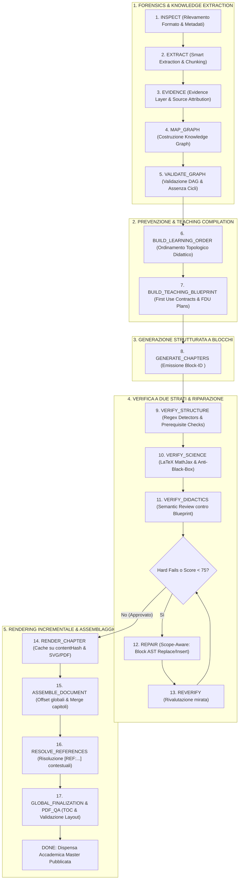

# 🎓 STUDYGENIUS — Il Sistema Operativo Accademico per Dispense Universitarie Magistrali

> **Documentazione Ufficiale di Progetto — Architettura, Filosofia Didattica e Funzionamento Meccanico**  
> *Versione: 3.0.0 — Architettura Oltre 1000 (Sintesi Gerarchica Preventiva ed Esecutiva)*  
> *Destinatari: Studenti, Docenti, Sviluppatori e Modelli di Linguaggio (LLM) che devono comprendere, utilizzare o estendere il sistema.*

---

## 📑 INDICE GENERALE

1. [Executive Summary (Sintesi Esecutiva)](#1-executive-summary-sintesi-esecutiva)
2. [L'Idea Fondamentale e la Rottura col Passato](#2-lidea-fondamentale-e-la-rottura-col-passato)
   - [2.1 Il fallimento dei riassunti tradizionali e dei prompt generici](#21-il-fallimento-dei-riassunti-tradizionali-e-dei-prompt-generici)
   - [2.2 La trappola della compressione](#22-la-trappola-della-compressione)
   - [2.3 Il nuovo paradigma: La Dispensa Magistrale Ricostruibile](#23-il-nuovo-paradigma-la-dispensa-magistrale-ricostruibile)
3. [Il Traguardo Didattico: Cosa si vuole ottenere](#3-il-traguardo-didattico-cosa-si-vuole-ottenere)
   - [3.1 I 4 Test di Padronanza dello Studente](#31-i-4-test-di-padronanza-dello-studente)
   - [3.2 Preparazione Integrata Scritto-Orale](#32-preparazione-integrata-scritto-orale)
   - [3.3 Standard Tipografico ed Editoriale di Pubblicazione](#33-standard-tipografico-ed-editoriale-di-pubblicazione)
4. [La Dottrina Didattica & Le Regole Fondamentali](#4-la-dottrina-didattica--le-regole-fondamentali)
   - [4.1 I 10 Invarianti Accademici di Livello 0 (Level-0 Invariants)](#41-i-10-invarianti-accademici-di-livello-0-level-0-invariants)
   - [4.2 Il Protocollo Anti-Black-Box Assoluto](#42-il-protocollo-anti-black-box-assoluto)
   - [4.3 Il Sistema dei Callout Semantici Didattici](#43-il-sistema-dei-callout-semantici-didattici)
   - [4.4 L'Epistemologia Disciplinare Differenziata](#44-lepistemologia-disciplinare-differenziata)
5. [L'Architettura "Oltre 1000": Sintesi Gerarchica a 3 Livelli](#5-larchitettura-oltre-1000-sintesi-gerarchica-a-3-livelli)
   - [5.1 La Formula Fondamentale della Qualità](#51-la-formula-fondamentale-della-qualità)
   - [5.2 I Tre Livelli: Prevenzione, Verifica e Riparazione](#52-i-tre-livelli-prevenzione-verifica-e-riparazione)
   - [5.3 Diagramma di Flusso End-to-End (La Pipeline a 17 Fasi)](#53-diagramma-di-flusso-end-to-end-la-pipeline-a-17-fasi)
6. [I Moduli del Sistema Operativo Accademico](#6-i-moduli-del-sistema-operativo-accademico)
   - [6.1 Step 0: Contratti Dati & Schemi JSON Formali (`src/core/schemas.js`)](#61-step-0-contratti-dati--schemi-json-formali-srccoreschemasjs)
   - [6.2 Modulo 1: Ingestion Ibrida Intelligente & Micro-Chunking (`server.js`)](#62-modulo-1-ingestion-ibrida-intelligente--micro-chunking-serverjs)
   - [6.3 Modulo 2: Knowledge Graph & Dependency DAG (`src/core/knowledgeGraph.js`)](#63-modulo-2-knowledge-graph--dependency-dag-srccoreknowledgegraphjs)
   - [6.4 Modulo 3: Pedagogical Compiler (`src/planning/pedagogicalCompiler.js`)](#64-modulo-3-pedagogical-compiler-srcplanningpedagogicalcompilerjs)
   - [6.5 Modulo 4: Teaching Blueprint Engine (`src/planning/blueprint.js`)](#65-modulo-4-teaching-blueprint-engine-srcplanningblueprintjs)
   - [6.6 Modulo 5: Compilatore Gerarchico di Prompt L0-L7 (`src/core/promptCompiler.js`)](#66-modulo-5-compilatore-gerarchico-di-prompt-l0-l7-srccorepromptcompilerjs)
   - [6.7 Modulo 6: Sharding Adattivo & Concurrency Pool Parallelo](#67-modulo-6-sharding-adattivo--concurrency-pool-parallelo)
   - [6.8 Modulo 7: Quality Engine Gerarchico & Hard-Fail Gates (`src/core/qualityEngine.js`)](#68-modulo-7-quality-engine-gerarchico--hard-fail-gates-srccorequalityenginejs)
   - [6.9 Modulo 8: Block Manager & AST Chirurgico (`src/generation/blockManager.js`)](#69-modulo-8-block-manager--ast-chirurgico-srcgenerationblockmanagerjs)
   - [6.10 Modulo 9: Scope-Aware Surgical Repair Engine (`src/generation/repairLoop.js`)](#610-modulo-9-scope-aware-surgical-repair-engine-srcgenerationrepairloopjs)
   - [6.11 Modulo 10: Visualization Engine Deterministico D3/SVG (`src/visualization/`)](#611-modulo-10-visualization-engine-deterministico-d3svg-srcvisualization)
   - [6.12 Modulo 11: Render Cache Incrementale dei Capitoli (`src/rendering/chapterArtifactManager.js`)](#612-modulo-11-render-cache-incrementale-dei-capitoli-srcrenderingchapterartifactmanagerjs)
   - [6.13 Modulo 12: Semantic Reference Resolver (`src/rendering/semanticReferenceResolver.js`)](#613-modulo-12-semantic-reference-resolver-srcrenderingsemanticreferenceresolverjs)
   - [6.14 Modulo 13: Global Assembler & TOC Generator (`src/rendering/globalAssembler.js`)](#614-modulo-13-global-assembler--toc-generator-srcrenderingglobalassemblerjs)
   - [6.15 Modulo 14: State Machine a 17 Fasi & Checkpointing (`src/core/jobState.js`)](#615-modulo-14-state-machine-a-17-fasi--checkpointing-srccorejobstatejs)
   - [6.16 Modulo 15: Interfaccia Utente Glassmorphic & Streaming Real-Time](#616-modulo-15-interfaccia-utente-glassmorphic--streaming-real-time)
7. [Mappa della Codebase & Struttura del Repository](#7-mappa-della-codebase--struttura-del-repository)
8. [Guida Operativa: Installazione, Avvio e Manutenzione](#8-guida-operativa-installazione-avvio-e-manutenzione)
   - [8.1 Requisiti di Sistema](#81-requisiti-di-sistema)
   - [8.2 Avvio Rapido (Windows)](#82-avvio-rapido-windows)
   - [8.3 Spegnimento del Server](#83-spegnimento-del-server)
   - [8.4 Test & Validazione Continua](#84-test--validazione-continua)
9. [Istruzioni per LLM e Sviluppatori Futuri](#9-istruzioni-per-llm-e-sviluppatori-futuri)

---

## 1. EXECUTIVE SUMMARY (SINTESI ESECUTIVA)

**StudyGenius** non è un semplice strumento di riassunto, né un'applicazione per "fare bignami" con l'intelligenza artificiale.  
È un **sistema operativo didattico ed epistemologico per l'istruzione universitaria superiore**.

Il sistema prende in ingresso materiale eterogeneo (manuali universitari di 500+ pagine, dispense dei professori, presentazioni PowerPoint con note del relatore, appunti manoscritti disordinati, fotografie o scansioni di lavagne) e lo trasforma in un'opera didattica magistrale autonoma: una **dispensa universitaria rigorosa, completa, auto-esplicativa e tipograficamente perfetta**.

### Punti Chiave dell'Architettura 3.0 ("Oltre 1000"):
1. **Sintesi Gerarchica tra Prevenzione e Riparazione:** L'approccio preventivo progetta il sistema affinché i buchi didattici vengano prodotti molto meno spesso; l'approccio ingegneristico esecutivo li intercetta e li corregge con precisione chirurgica.
2. **Pedagogical Compiler & Learning Order Topologico:** Prima della generazione, il compilatore pedagogico analizza il Knowledge Graph e deduce l'ordine logico ottimale di apprendimento, formalizzando i contratti di primo utilizzo (`FirstUseContract`) e i blocchi di motivazione (`Motivation Bridge`).
3. **Formal Dependency Units (FDU) & stepSignificance:** Superata la rigidità dei falsi positivi di "Bare Definition": le definizioni accoppiate alla propria equazione formalizzante e interpretazione immediata costituiscono un'unità pedagogica coesa. I passaggi matematici sono graduati (`LOW`, `MEDIUM`, `HIGH`) evitando prosa sterile nell'algebra locale e pretendendo `WHY + WHAT CHANGED + CONSEQUENCE` nelle transizioni concettuali.
4. **Quality Engine Gerarchico con Hard Fails:** Nessun punteggio medio può mascherare un errore strutturale. Violazioni didattiche fondamentali come `PREREQUISITE_VIOLATION` o `UNRESOLVED_FIRST_USE` bocciano tassativamente il documento (`passed: false`).
5. **Block-ID Structural Repair (Zero String Replace):** Abolito categoricamente `fullText.replace()`. Il documento è mappato in un albero AST di blocchi identificati (`<!-- BLOCK:type:id -->`). Il repair opera sullo scope esatto dell'anomalia (`INLINE`, `BLOCK`, `SECTION`, `CHAPTER`, `GLOBAL`).
6. **Visualization Engine Deterministico (Formula-derived D3/SVG):** I grafici non sono disegnati a mano libera dall'LLM. Il modello decide cosa rappresentare, il motore matematico calcola i punti numerici esatti e genera l'SVG vettoriale. Il Quality Engine verifica la coerenza numerica testo $\leftrightarrow$ grafico (`GRAPH_TEXT_INCONSISTENCY`).
7. **Render Cache Incrementale & Global Assembly:** I capitoli sono artifact autonomi dotati di hash crittografico. Se il testo non cambia, il PDF parziale viene riutilizzato istantaneamente (zero-latency cache hit). I riferimenti logici `[REF:...]` e l'indice (TOC) vengono risolti dopo l'impaginazione globale reale con calcolo cumulativo degli offset.

---

## 2. L'IDEA FONDAMENTALE E LA ROTTURA COL PASSATO

### 2.1 Il fallimento dei riassunti tradizionali e dei prompt generici
Se si chiede a un modello di linguaggio convenzionale (ChatGPT, Claude o Gemini standard) *"fammi il riassunto di questo capitolo di fisica o chimica"*, il risultato tipico è un disastro accademico:
- Il modello riassume per ellissi: toglie le parole che collegano le equazioni, lasciando una serie di formule isolate.
- Introduce grandezze "calate dall'alto" senza aver prima spiegato il problema fenomenologico o la limitazione del modello precedente che rende necessaria quella quantità.
- Omette i passaggi algebrici intermedi, usando formule pigre come *"integrando si ottiene facilmente..."* o *"per motivi di simmetria è banale verificare che..."*.
- Ignora gli errori tipici commessi dagli studenti agli esami e non allena la capacità di argomentare e difendere le scelte teoriche durante un colloquio orale.

### 2.2 La trappola della compressione
Nell'immaginario comune, "riassumere" significa "ridurre il numero di pagine". Negli esami universitari di discipline quantitative o formali (Fisica Generale, Chimica Analitica, Analisi Matematica, Diritto Privato, Economia Politica), la riduzione cieca del testo è fatale:
$$\text{Compressione Cieca} \implies \text{Perdita dei Passaggi Intermedi} \implies \text{Apprendimento Mnemonico} \implies \text{Blocco all'Esame}$$

Se uno studente dimentica una formula appresa a memoria, l'esame è perso. Se invece lo studente ha compreso la **genealogia dell'equazione** (il fenomeno da cui nasce, le ipotesi fisiche, la legge generale e la derivazione passo-passo), saprà ricavarla da zero al tavolo della commissione esaminatrice.

### 2.3 Il nuovo paradigma: La Dispensa Magistrale Ricostruibile
StudyGenius inverte la prospettiva:

> *"Il materiale didattico fornito dallo studente è un punto di partenza, non uno stampo. Il compito del sistema non è sintetizzare il testo, ma costruire un modello formale della conoscenza, pianificare la sequenza pedagogica e produrre una dispensa al 100% ricostruibile, applicabile e difendibile."*

```
                    MATERIALE DISORDINATO
        (Slide sintetiche, appunti a mano, foto, dispense dense)
                                  │
                                  ▼
                      PIPELINE STUDYGENIUS
      (Pedagogical Compiler + Knowledge Graph + Teaching Blueprint + Quality Engine)
                                  │
                                  ▼
                    DISPENSA MAGISTRALE INTEGRALE
    ┌─────────────────────────────────────────────────────────────┐
    │ • Teoria Parlata e Intuizione Fenomenologica               │
    │ • Formal Dependency Units (Definizione + Formula + Senso)   │
    │ • Nessuna Formula Senza Storia (Ipotesi -> Derivazione)     │
    │ • Protocollo Anti-Black-Box (Zero salti concettuali)        │
    │ • Grafici Deterministici Matematicamente Esatti             │
    │ • Eserciziario Guidato (Schema Mentale + Coerenza)         │
    │ • Trappole d'Esame e Domande per l'Orale                   │
    │ • Tipografia LaTeX vettoriale stampabile in PDF A4         │
    └─────────────────────────────────────────────────────────────┘
```

---

## 3. IL TRAGUARDO DIDATTICO: COSA SI VUOLE OTTENERE

### 3.1 I 4 Test di Padronanza dello Studente
Ogni capitolo o sezione generata deve superare l'audit delle 4 domande didattiche:

1. **"Can I Reconstruct It?" (Lo studente saprebbe ricostruirlo?):**
   Se lo studente dimentica la formula a distanza di settimane, la trattazione fornisce tutti i passaggi algebrici e logici per ricalcolarla dai primi principi?
2. **"Can I Explain It?" (Lo studente saprebbe spiegarlo a voce?):**
   Il testo offre una spiegazione discorsiva e intuitiva del fenomeno (*"cosa accade a livello microscopico o qualitativo prima delle equazioni?"*) adatta al colloquio orale?
3. **"Can I Use It?" (Lo studente riconosce quando applicarlo?):**
   Viene esplicitato non solo il calcolo, ma il criterio decisionale per riconoscere *quando* e *perché* usare un determinato modello rispetto a un altro?
4. **"Can I Defend It?" (Lo studente saprebbe difendere le ipotesi contestate?):**
   Se la commissione d'esame chiedesse *"Perché ha trascurato la resistenza dell'aria?", "Perché ha scelto questa superficie gaussiana?"* o *"Perché l'attività dei solidi puri è 1?"*, lo studente ha la risposta pronta ed esaustiva?

### 3.2 Preparazione Integrata Scritto-Orale
- **Per lo Scritto:** Ogni esercizio estratto dal materiale viene risolto seguendo il protocollo a sei stadi:
  $$\text{Consegna Fedele} \to \text{Dati \& Incognite (SI)} \to \text{Schema Mentale} \to \text{Calcolo Passo-Passo} \to \text{Risultato \& Unità} \to \text{Verifica di Coerenza}$$
- **Per l'Orale:** In coda a ciascuna trattazione vengono generate domande insidiose tipiche dei docenti universitari, accompagnate da risposte modello basate sulla difesa delle ipotesi e sull'analisi dei casi limite ($r \to 0$, $r \to \infty$, $T \to 0$, approssimazioni analitiche).

### 3.3 Standard Tipografico ed Editoriale di Pubblicazione
- Frontespizio istituzionale incorniciato con ateneo, materia, notazione impiegata e data.
- Tipografia classica scientifica basata sul font **STIX Two Text** e **JetBrains Mono**.
- Formule matematiche centrate e in riga con glifi LaTeX vettoriali nitidi generati lato server con MathJax SVG.
- Gestione perfetta delle interruzioni di pagina (`break-inside: avoid` per tabelle, teoremi, grafici e callout).

---

## 4. LA DOTTRINA DIDATTICA & LE REGOLE FONDAMENTALI

### 4.1 I 10 Invarianti Accademici di Livello 0 (Level-0 Invariants)
Nessuna istruzione, preferenza utente o modalità di studio può derogare a questi 10 principi:

1. **Verità, Completezza e Comprensibilità:** La dimostrazione deve essere matematicamente ineccepibile, esplicitare ogni vincolo e risultare ricostruibile.
2. **Nessuna Formula Senza Storia:** Ogni legge deve mostrare il problema da cui nasce, le ipotesi, le unità di misura, la legge madre, lo sviluppo e i casi limite.
3. **Protocollo Anti-Black-Box Assoluto:** Vietate scorciatoie verbali che nascondano la logica.
4. **Distinzione Chiara delle Competenze:** Esplicitazione di ciò che va ricordato, compreso, dimostrato, applicato o difeso all'orale.
5. **Leggi Generali vs Conseguenze Particolari:** Non confondere leggi universali di natura con formule valide solo sotto specifiche simmetrie.
6. **Traccia di Calcolo Strutturata e Schema Mentale:** Esplicitare il "perché" strategico prima di ogni calcolo numerico.
7. **Controlli di Coerenza Obbligatori:** Verifica dimensionale (SI), controllo di segno fisico, comportamento ai limiti asintotici e coerenza di simmetria.
8. **Presenza Sistematica delle Trappole d'Esame:** Identificazione proattiva dei trabocchetti e degli errori ricorrenti degli studenti.
9. **Preparazione Integrata Scritto-Orale:** Domande di ragionamento e difesa delle approssimazioni.
10. **Minimum Sufficient Explanation:** Nessun passaggio indispensabile viene omesso; si eliminano solo le ripetizioni sterili.

### 4.2 Il Protocollo Anti-Black-Box Assoluto

| Formula Opaca Vietata | Difetto Epistemico | Sostituzione Obbligatoria Richiesta |
|---|---|---|
| *"Per simmetria si ha..."* | Nasconde l'invarianza geometrica che giustifica la semplificazione. | Specificare il tipo di simmetria (rotazionale, piana, assiale), quale coordinata scompare e perché le componenti ortogonali si annullano. |
| *"È evidente che..." / "È ovvio che..."* | Presume conoscenze pregresse che spesso nascondono trappole d'esame. | Esplicitare l'assioma, la definizione o il passaggio algebrico che determina la conseguenza. |
| *"Integrando si ottiene..."* | Omette gli estremi, il cambio di variabile e le condizioni al contorno. | Mostrare l'integrale definito, la sostituzione, la primitiva e il calcolo negli estremi. |
| *"Analogamente per il caso B..."* | Assume che le condizioni al contorno siano identiche quando non lo sono. | Dichiarare quali ipotesi rimangono e quale singola variazione differenzia il caso B. |
| *"Trascurando i termini superiori..."* | Omette la giustificazione analitica dell'approssimazione. | Indicare il parametro adimensionale piccolo ($\varepsilon \ll 1$) e l'ordine di troncamento della serie di Taylor ($o(\varepsilon^2)$). |
| *"Si vede chiaramente dal grafico..."* | Sostituisce la prova analitica con l'impressione visiva. | Indicare le proprietà della derivata prima (crescenza) e seconda (concavità) che governano l'andamento. |

### 4.3 Il Sistema dei Callout Semantici Didattici
```markdown
> 📌 **Definizione Rigorosa:** Enunciato formale, simboli e condizioni di validità.
> 💡 **Intuizione & Senso Fisico:** Spiegazione qualitativa e discorsiva del fenomeno.
> 📐 **Teorema & Dimostrazione:** Ipotesi, costruzione, tesi e dimostrazione passo-passo.
> ⚠️ **Attenzione / Errore Tipico d'Esame:** Fraintendimenti frequenti e trabocchetti.
> 🧠 **Schema Mentale & Strategia:** Algoritmo concettuale di risoluzione del problema.
> 🔍 **Controllo di Coerenza (Dimensionale / Segno / Limiti):** Verifica critica dei risultati.
> 📋 **Formulario Ragionato:** Tabella formule con significato, unità SI e limiti.
> 🎓 **Domande d'Esame (Scritto & Orale):** Domande di verifica con risposte argomentate.
```

### 4.4 L'Epistemologia Disciplinare Differenziata
- **Fisica Generale:** Coordinate $\to$ Versori $\to$ Modello/Mezzo $\to$ Equazioni differenziali $\to$ Condizioni al contorno $\to$ Derivazione $\to$ Controllo dimensionale e limiti.
- **Chimica Generale & Analitica:** Reazione bilanciata $\to$ Meccanismo microscopico $\to$ Termodinamica ($\Delta G, K_{eq}$) $\to$ Tabelle ICE $\to$ Bilanci di massa e carica $\to$ Verifica delle approssimazioni analitiche.
- **Matematica & Analisi:** Definizione metrica $\to$ Ipotesi $\to$ Costruzione $\to$ Tesi $\to$ Catena algebrica rigorosa $\to$ Controesempi quando cadono le ipotesi.
- **Informatica:** Specifica formale $\to$ Pseudocodice $\to$ Invarianti di ciclo $\to$ Complessità temporale/spaziale asintotica ($O, \Omega, \Theta$) $\to$ Edge cases.
- **Diritto:** Fonte del diritto $\to$ Ratio legis $\to$ Fattispecie astratta vs concreta $\to$ Interpretazione giurisprudenziale e dottrinale $\to$ Casi applicativi.
- **Economia:** Modello teorico $\to$ Assunzioni di mercato $\to$ Formalizzazione con vincoli di massimizzazione $\to$ Statica comparata $\to$ Interpretazione economica delle derivate.

---

## 5. L'ARCHITETTURA "OLTRE 1000": SINTESI GERARCHICA A 3 LIVELLI

### 5.1 La Formula Fondamentale della Qualità
L'intera architettura è governata dalla seguente equazione invariante:

$$\boxed{ \text{Quality} = \text{Knowledge Integrity} + \text{Pedagogical Integrity} + \text{Scientific Integrity} + \text{Representation Integrity} }$$

- **Knowledge Integrity:** Accuratezza del grafo, tracciamento delle fonti (*Evidence Layer*), DAG delle dipendenze esente da cicli illegittimi.
- **Pedagogical Integrity:** Ordine di apprendimento topologico, motivazione preventiva del bisogno di nuove quantità (*Motivation Bridge*), contratti di primo utilizzo (*First Use Contract*), interpretazione fenomenologica.
- **Scientific Integrity:** Correttezza formale delle equazioni, esplicitazione delle ipotesi, assenza di scorciatoie black-box, verifica dimensionale.
- **Representation Integrity:** Resa grafica deterministica (testo, formule LaTeX MathJax SVG, grafici D3 campionati, riferimenti semantici `[REF:...]`, impaginazione PDF A4).

Nessuna delle quattro dimensioni può compensare o nascondere un fallimento delle altre.

### 5.2 I Tre Livelli: Prevenzione, Verifica e Riparazione

```
┌──────────────────────────────────────────────────────────────────────────────┐
│ LIVELLO 1 — PREVENZIONE (Pedagogical Compiler & Teaching Blueprint)          │
│ • Qual è l'ordine didattico topologicamente corretto?                        │
│ • Quali contratti vincolano i concetti prima del loro esordio simbolico?     │
└──────────────────────────────────────┬───────────────────────────────────────┘
                                       │
                                       ▼
┌──────────────────────────────────────────────────────────────────────────────┐
│ LIVELLO 2 — VERIFICA (Due Strati: Deterministic Structural QA + Semantic QA) │
│ • Regex come detector di configurazioni sospette (NON come giudici ciechi).  │
│ • Hard-Fails strutturali: PREREQUISITE_VIOLATION, INVALID_REFERENCE, ecc.    │
│ • Didactic Reviewer semantico con specifica contrattuale del Blueprint.      │
└──────────────────────────────────────┬───────────────────────────────────────┘
                                       │
                                       ▼
┌──────────────────────────────────────────────────────────────────────────────┐
│ LIVELLO 3 — RIPARAZIONE (Block-ID AST & Scope-Aware Repair Engine)           │
│ • Abolizione del fragile fullText.replace(). Manipolazione per Block ID.    │
│ • Scope mirato: INLINE, BLOCK, SECTION, CHAPTER, GLOBAL.                     │
│ • Strategie regolate da Allowed Edits e Forbidden Edits.                     │
└──────────────────────────────────────────────────────────────────────────────┘
```

### 5.3 Diagramma di Flusso End-to-End (La Pipeline a 17 Fasi)



---

## 6. I MODULI DEL SISTEMA OPERATIVO ACCADEMICO

### 6.1 Step 0: Contratti Dati & Schemi JSON Formali (`src/core/schemas.js`)
Nessuna riga di testo o codice viene manipolata senza passare attraverso la validazione formale di 10 contratti JSON Schema rigorosamente tipizzati:
1. `KnowledgeGraph (v2.0.0)`: Nodi, relazioni dirette, attributi epistemici e attribuzioni di sorgente.
2. `FirstUseContract`: Regole di esordio per nuovi concetti e simboli (`mustMotivate`, `mustDefine`, `mustInterpret`, `mustExplainBeforeSymbolicUse`).
3. `TeachingBlueprint (v2.0.0)`: Il contratto didattico del capitolo con `learningObjectives`, `conceptOrder`, `conceptBlocks` e piani di derivazione.
4. `ConceptBlock`: Struttura del blocco di testo indicizzato per ID (`blockId`, `conceptId`, `blockType`, `stepSignificance`, `content`).
5. `Violation`: Report strutturato delle anomalie rilevate (`type`, `severity: HARD_FAIL | WARNING`, `scope`, `message`, `details`).
6. `RepairRequest`: Richiesta chirurgica di riparazione con `allowedEdits` e `forbiddenEdits`.
7. `ChapterArtifact`: Il capitolo autonomo compilato (`contentHash`, `renderHash`, `status`, `blocks`, `pageOffset`, `pageCount`).
8. `SemanticReference`: Il riferimento logico `[REF:...]` con risoluzione testuale e numerica di pagina.
9. `GraphSpec (v1.0.0)`: La specifica deterministica della funzione da campionare (`domain`, `series`, `provenance: FORMULA-derived`).
10. `JobState (v3.0.0)`: Lo stato persistente della sessione lungo le 17 fasi, con monitoraggio per capitolo e lista `invalidatedChapters`.

---

### 6.2 Modulo 1: Ingestion Ibrida Intelligente & Micro-Chunking (`server.js`)
- **Smistamento a Costo Zero:** I PDF con testo nativo vengono elaborati istantaneamente via `pdf-parse` in locale senza chiamate API.
- **Supporto PowerPoint:** File `.pptx` e `.ppt` letti da `officeparser` con estrazione combinata di slide e note del relatore.
- **Ritaglio Personalizzato di Pagine:** Taglio selettivo dei buffer PDF tramite `pdf-lib` prima dell'elaborazione.
- **Micro-Chunking Anti-Saturazione per Scansioni:** Le scansioni e gli appunti manoscritti vengono processati a blocchi di massimo **5 pagine** con Google Gemini Multimodal Vision, evitando la saturazione della finestra di contesto e garantendo la trascrizione integrale di pedici, apici e note marginali.

---

### 6.3 Modulo 2: Knowledge Graph & Dependency DAG (`src/core/knowledgeGraph.js`)
- **Topological Sorting (`getTopologicalOrder`):** Calcola la sequenza lineare dei nodi garantendo che ogni prerequisito compaia prima del concetto dipendente.
- **Dependency Invalidation (`getDependentChapters`):** Individua istantaneamente quali capitoli sono impattati dalla modifica di un concetto nel grafo, abilitando la **ricostruzione incrementale intelligente** (*Dependency-Aware Incremental Rebuild*).
- **Relazioni Semantiche Avanzate:** `REQUIRES`, `DERIVES_FROM`, `MOTIVATED_BY`, `SPECIAL_CASE_OF`, `APPLIES`, `REVIEW_OF`.
- **Deduplicazione Canonica & Subject KB:** Evita la re-derivazione da zero di concetti già formalizzati in sessioni precedenti, sostituendoli con callout di richiamo (`REVIEW_OF`).

---

### 6.4 Modulo 3: Pedagogical Compiler (`src/planning/pedagogicalCompiler.js`)
Il compilatore didattico interviene **prima** della generazione testuale:
- Genera il **Learning Order** topologico.
- Programma blocchi `MOTIVATION_BRIDGE` prima dell'introduzione di quantità che richiedono una giustificazione fenomenologica (es. mostrare perché $[M]_{libero} \neq [M]_{totale}$ prima di introdurre il coefficiente $\alpha$).
- Formalizza le **Formal Dependency Units (FDU)** che accoppiano `Definizione + Equazione formalizzante + Interpretazione fisica`.
- **Classificazione delle Manipolazioni Matematiche (`mathOperation`):** Classifica ogni passaggio previsto (`MATH_OP_TYPES`: `derivative`, `integral`, `algebra`, `substitution`, `trig_identity`, `vector_identity`, `limit`).
- **Math Rules Registry (`mathRules`):** Pre-compila nel Blueprint il bagaglio di regole matematiche attese per ciascun concetto (es. regola della catena, derivata del seno, integrazione per parti), vincolando il generatore a citarle esplicitamente.
- Assegna a ogni passaggio matematico la sua `stepSignificance`:
  - `LOW` (Algebra locale): calcolo compatto, nessuna spiegazione artificiale forzata.
  - `MEDIUM` (Trasformazione significativa): richiede `WHAT CHANGED`.
  - `HIGH` (Ipotesi fisica, cambio di base, rotori vettoriali): richiede `WHY + WHAT CHANGED + CONSEQUENCE`.
- Compila la direttiva di prompt arricchita con vincoli sui marcatori di blocco (`<!-- BLOCK:type:id -->`) e il protocollo di provenienza matematica.

---

### 6.5 Modulo 4: Teaching Blueprint Engine (`src/planning/blueprint.js`)
Fornisce la specifica contrattuale per ciascun capitolo della dispensa:
- `chapterId`, `title`, `learningObjectives`.
- `conceptOrder`: ordinamento cronologico obbligatorio.
- `firstUseContracts`: contratti di primo utilizzo per ciascun simbolo o concetto.
- `conceptBlocks`: la lista pianificata dei blocchi attesi con `mathOperation` e `stepSignificance`.
- `mathRules`: il registro delle regole matematiche attese per il capitolo.
- `graphPlans`: specifiche dei grafici deterministici collegati.

---

### 6.6 Modulo 5: Compilatore Gerarchico di Prompt L0-L7 (`src/core/promptCompiler.js`)
Costruisce le istruzioni per il generatore attraverso 8 livelli di vincoli concentrici:
`Level 0 (Invarianti)` $\to$ `Level 1 (Modus Operandi)` $\to$ `Level 2 (Epistemologia)` $\to$ `Level 3 (Prompt Disciplinare)` $\to$ `Level 4 (Policy Task)` $\to$ `Level 5 (Profilo Studente)` $\to$ `Level 6 (Formato Tipografico)` $\to$ `Level 7 (Anti-Black-Box & Mathematical Provenance)`.

#### Protocollo Vincolante per i Passaggi Matematici (Level 7):
Ogni derivata, integrale o manipolazione vettoriale con `stepSignificance >= MEDIUM` o tipo `DERIVATIVE`/`INTEGRAL` deve seguire la struttura a 5 punti:
1. **Dichiarazione dell'operazione:** Cosa si calcola (es. "Calcoliamo la derivata parziale rispetto a $x$").
2. **Regola generale utilizzata:** La formula formale (es. "$\frac{d}{dx}\sin(u) = \cos(u) \cdot \frac{du}{dx}$ (regola della catena)").
3. **Sostituzione concreta:** Le variabili interne (es. "Ponendo $u = kx - \omega t + \delta$, si ha $\frac{du}{dx} = k$").
4. **Calcolo intermedio:** Il passaggio intermedio esplicito (es. "$\frac{\partial \xi}{\partial x} = \xi_0 \cdot \cos(u) \cdot k$").
5. **Risultato finale:** Forma semplificata (es. "$\frac{\partial \xi}{\partial x} = \xi_0 k \cos(kx - \omega t + \delta)$").

---

### 6.7 Modulo 6: Sharding Adattivo & Concurrency Pool Parallelo
Per grandi volumi didattici (> 50.000 caratteri), il materiale viene suddiviso in shard logici paralleli coordinati dal Global Master Plan e dai ruoli specializzati (`shardRoles.js`). La generazione concorrente sfrutta la massima ampiezza di contesto senza rischi di timeout.

---

### 6.8 Modulo 7: Quality Engine Gerarchico & Hard-Fail Gates (`src/core/qualityEngine.js`)
Struttura rigorosa del verdetto:
$$\text{PASSED} \iff (\text{hardFails.length} === 0) \land (\text{softScore} \ge 75)$$

#### Hard-Fails Bloccanti di Primo Livello:
1. **`PREREQUISITE_VIOLATION`:** Rileva se un concetto dipendente compare prima del suo prerequisito necessario.
2. **`UNRESOLVED_FIRST_USE`:** Rileva l'uso di un simbolo matematico o quantità prima che ne sia stato motivato il bisogno o definito il senso fisico.
3. **`INVALID_REFERENCE`:** Rileva riferimenti semantici `[REF:...]` a entità o capitoli inesistenti.
4. **`MISSING_MATH_RULE` (Gate 2B - Mathematical Provenance):** Rileva deterministicamente passaggi di derivazione o integrazione privi di regola matematica esplicitata (Anti-Black-Box applicato agli strumenti matematici).
5. **`GRAPH_TEXT_INCONSISTENCY`:** Confronto numerico deterministico tra affermazioni nel testo e dati calcolati del grafico (tolleranza 2%).
6. **`BARE_DEFINITION` con FDU Detector:** Le regex identificano solo configurazioni sospette; se la definizione include formula e interpretazione fisica (*Formal Dependency Unit*), viene accettata senza falsi positivi.
7. **`UNEXPLAINED_FORMAL_TRANSITION`:** Rileva passaggi matematici ad alta significatività (rotori, integrali di linea) privi di motivazione concettuale.
8. **`LATEX_SYNTAX_ERROR` & `EMPTY_FORMULA_RENDER`:** Validazione formale della sintassi MathJax e verifica che le formule non generino SVG vuoti o degeneri.
9. **`LLM_PREAMBLE_LEAK`:** Intercetta preamboli conversazionali dell'LLM (*"Certamente, ecco a te..."*).

---

### 6.9 Modulo 8: Block Manager & AST Chirurgico (`src/generation/blockManager.js`)
- Esegue il parsing bidirezionale del testo identificando i blocchi:
  `<!-- BLOCK:blockType:blockId --> ... <!-- /BLOCK:blockType:blockId -->`.
- `replaceBlock(document, targetBlockId, newContent)`: sostituzione chirurgica isolata per ID.
- `insertBlock(document, targetBlockId, newBlock, 'before'|'after')`: inserimento di blocchi ponte.
- `moveBlock(document, blockIdToMove, targetBlockId, 'before')`: riordinamento strutturale per sanare violazioni di precedenza didattica.

---

### 6.10 Modulo 9: Scope-Aware Surgical Repair Engine (`src/generation/repairLoop.js`)
Interviene selettivamente in base alla violazione e al suo raggio d'azione:
- **`INLINE`:** Correzione di singoli valori numerici (es. sincronizzazione claim testo $\leftrightarrow$ grafico).
- **`BLOCK`:** Espansione mirata del singolo blocco (es. aggiunta della formula o dell'interpretazione a una definizione) con vincoli `allowedEdits` e `forbiddenEdits`.
- **`MISSING_MATH_RULE` (Surgical Mathematical Provenance Repair):** Isola il passaggio di derivazione incriminato tramite coordinate o Block ID, impone la rigorosa immutabilità delle formule (`CHANGE_FORMULA` vietato) e incarica l'agente esperto di didattica matematica di iniettare la regola generale, la sostituzione esplicita e il passaggio intermedio via `blockManager.replaceBlock`.
- **`SECTION`:** Inserimento di `MOTIVATION_BRIDGE` o riordinamento di blocchi adiacenti.
- **`CHAPTER` / `GLOBAL`:** Risanamento di riferimenti incrociati o sezioni mancanti.

---

### 6.11 Modulo 10: Visualization Engine Deterministico D3/SVG (`src/visualization/`)
- **Principio Assoluto:** L'LLM decide *cosa* rappresentare (specifica `GraphSpec`); un motore deterministico (`dataBuilder.js`) calcola i dati con `mathjs`; D3.js compila l'SVG vettoriale millimetrato.
- **Provenienza Obbligatoria:** Solo formule matematiche verificate (`FORMULA-derived`).
- **Verifica Coerenza:** Il blocco `json:graphClaims` consente all'autore di dichiarare le proprietà della curva (massimi, zeri, asintoti), che il Quality Engine verifica matematicamente sui dati reali.

---

### 6.12 Modulo 11: Render Cache Incrementale dei Capitoli (`src/rendering/chapterArtifactManager.js`)
- Ogni capitolo viene compilato come un **`ChapterArtifact` autonomo** (`.json`, `.md`, `.pdf`).
- Viene calcolato un `contentHash` crittografico (SHA-256 su testo, versione di stile e versione MathJax).
- Se il contenuto non è mutato e il PDF esiste su disco, il rendering viene riutilizzato istantaneamente: **zero chiamate Puppeteer, zero latenza**.

---

### 6.13 Modulo 12: Semantic Reference Resolver (`src/rendering/semanticReferenceResolver.js`)
- Consente all'autore e all'LLM di inserire citazioni logiche: `[REF:chapter.cap02]` o `[REF:concept.alpha-coefficient]`.
- Mappa i riferimenti rispetto all'impaginazione reale e li traduce dinamicamente:
  - Nello stesso capitolo: *"come definito sopra (pag. 14)"*.
  - Tra capitoli diversi: *"nel Capitolo 2 («Complessazione», pag. 28)"*.

---

### 6.14 Modulo 13: Global Assembler & TOC Generator (`src/rendering/globalAssembler.js`)
- `calculateGlobalOffsets`: calcola gli offset di pagina cumulativi per tutti i capitoli.
- `generateStructuredTOC`: produce l'Indice Generale (TOC) con numeri di pagina esatti, numero di parole e tempo stimato di studio.
- `assembleMasterPdf`: unisce i singoli PDF parziali in un documento unico tramite `pdf-lib`, iniettando metadati editoriali istituzionali.

---

### 6.15 Modulo 14: State Machine a 17 Fasi & Checkpointing (`src/core/jobState.js`)
Pipeline con ripresa persistente (resumability) lungo 17 fasi:
`INSPECT` $\to$ `EXTRACT` $\to$ `EVIDENCE` $\to$ `MAP_GRAPH` $\to$ `VALIDATE_GRAPH` $\to$ `BUILD_LEARNING_ORDER` $\to$ `BUILD_TEACHING_BLUEPRINT` $\to$ `GENERATE_CHAPTERS` $\to$ `VERIFY_STRUCTURE` $\to$ `VERIFY_SCIENCE` $\to$ `VERIFY_DIDACTICS` $\to$ `REPAIR` $\to$ `REVERIFY` $\to$ `RENDER_CHAPTER` $\to$ `ASSEMBLE_DOCUMENT` $\to$ `RESOLVE_REFERENCES` $\to$ `GLOBAL_FINALIZATION` $\to$ `PDF_QA` $\to$ `DONE`.
Supporta il tracciamento dello stato per singolo capitolo e l'invalidazione incrementale selettiva (`invalidateChapters`).

---

### 6.16 Modulo 15: Interfaccia Utente Glassmorphic & Streaming Real-Time
- **Estetica Dark Glassmorphic:** Palette HSL professionale, card traslucide con `backdrop-filter`, micro-animazioni a 60 FPS.
- **Streaming Live Zero-Lag:** Visualizzazione real-time dei delta testuali generati da tutti i worker paralleli, con conteggio parole rapido e indicatore di avanzamento fluido.
- **Modalità Lettura a Schermo Intero:** Preview immersiva a tutta pagina con typography accademica (STIX Two Text), rendering MathJax dal vivo e barra flottante di controllo sessione.

---

## 7. MAPPA DELLA CODEBASE & STRUTTURA DEL REPOSITORY

```text
riassunti università/
├── .agents/                                # Intelligence & Dottrina Globale
│   ├── rules/                              # Invarianti accademici e anti-black-box
│   └── skills/chapter_compilation/         # Modus operandi e audit didattico
│
├── progetto/                               # Documentazione Ufficiale
│   └── README.md                           # Questo documento di architettura integrale (v3.0.0)
│
└── StudyGenius/                            # Applicazione Web & Motore Accademico
    ├── AVVIA.bat                           # Script Windows avvio rapido (porta 3000)
    ├── CHIUDI SERVER.bat                   # Script Windows chiusura processi orfani
    ├── package.json                        # Dipendenze Node.js (Express, MathJax, D3, pdf-lib, ecc.)
    ├── server.js                           # Server orchestratore principale e streaming SSE
    ├── .env                                # Chiavi API (GEMINI_API_KEY, DEEPSEEK_API_KEY)
    │
    ├── src/                                # Architettura a Livelli "Oltre 1000"
    │   ├── core/                           # Specifiche dei dati e motori di validazione
    │   │   ├── schemas.js                  # I 10 Contratti JSON Schema e validatori formali (Step 0)
    │   │   ├── knowledgeGraph.js           # DAG concettuale, ordinamento topologico e invalidation
    │   │   ├── graphValidator.js           # Validatore formale del grafo
    │   │   ├── contract.js                 # AcademicContract
    │   │   ├── promptCompiler.js           # Compilatore di prompt L0-L7
    │   │   ├── qualityEngine.js            # Quality Engine gerarchico a due strati e Hard-Fails
    │   │   ├── coverageMatrix.js           # Matrice di copertura concettuale
    │   │   ├── textSanitizer.js            # Sanitizzatore preamboli conversazionali e code spans
    │   │   └── jobState.js                 # State machine v3 a 17 fasi e checkpointing
    │   │
    │   ├── planning/                       # Compilazione pedagogica e contratti
    │   │   ├── pedagogicalCompiler.js      # Compilatore pedagogico: Learning Order, FDU, First Use
    │   │   └── blueprint.js                # Teaching Blueprint Engine v2
    │   │
    │   ├── generation/                     # Generazione e riparazione strutturale
    │   │   ├── blockManager.js             # Parser AST dei blocchi e manipolazioni chirurgiche per ID
    │   │   ├── repairLoop.js               # Scope-Aware Surgical Repair Engine (INLINE/BLOCK/SECTION)
    │   │   ├── shardRoles.js               # Ruoli specializzati dei worker concorrenti
    │   │   └── seamWelding2.js             # Saldatura delle giunzioni e Notation Manager
    │   │
    │   ├── visualization/                  # Visualization Engine Deterministico
    │   │   ├── graphSpec.js                # Schema e validazione formale GraphSpec v1
    │   │   ├── dataBuilder.js              # Campionamento deterministico formule con mathjs
    │   │   ├── graphValidator.js           # Validazione dataset e verifica claim testo<->grafico
    │   │   ├── graphRenderer.js            # Render SVG vettoriale con D3.js
    │   │   └── index.js                    # Facade del Visualization Engine
    │   │
    │   ├── rendering/                      # Rendering incrementale e assemblaggio globale
    │   │   ├── chapterArtifactManager.js   # Chapter artifacts autonomi e Render Cache su contentHash
    │   │   ├── semanticReferenceResolver.js# Risolutore semantico dei riferimenti logici [REF:...]
    │   │   ├── globalAssembler.js          # Calcolo offset, generatore TOC strutturato e PDF merge
    │   │   ├── diagramEngine.js            # Motore diagrammi MathJax SVG e mhchem
    │   │   └── pdfQA.js                    # Bounding box layout QA
    │   │
    │   ├── epistemology/                   # Statuti epistemologici disciplinari
    │   │   ├── index.js, physics.js, chemistry.js, math.js, computerScience.js, humanities.js
    │   │
    │   └── verification/                   # Audit multi-agente
    │       └── critics.js                  # Math, Pedagogy, Exam Defense Critics
    │
    ├── public/                             # Interfaccia Utente Web Glassmorphic
    │   ├── index.html                      # Layout SPA
    │   ├── app.js                          # Client JS, SSE live streaming e modal a schermo intero
    │   └── style.css                       # CSS glassmorphic dark
    │
    └── test_*.js                           # Suite di Test Automatizzati
        ├── test_schemas_contracts.js       # Validazione dei 10 contratti dati Step 0
        ├── test_pedagogical_compiler.js    # Test Learning Order topologico e First Use Contracts
        ├── test_quality_engine_hierarchical.js # Test Hard-Fails (PREREQUISITE_VIOLATION, FDU, ecc.)
        ├── test_block_surgical_repair.js   # Test manipolazione AST blocchi e repair per ID
        ├── test_incremental_render_cache.js# Test Render Cache, resolver riferimenti e PDF merge
        ├── test_visualization_engine.js    # Test calcolo dati D3 e coerenza testo<->grafico
        ├── test_teaching_system_milestones.js # Test deduplicazione canonica e gates matematici
        └── test_synthesis_scope_system.js  # Test modalità sintesi e filtraggio argomenti
```

---

## 8. GUIDA OPERATIVA: INSTALLAZIONE, AVVIO E MANUTENZIONE

### 8.1 Requisiti di Sistema
- **Node.js:** Versione 18.x o superiore (LTS raccomandata).
- **Sistema Operativo:** Windows 10/11, Linux o macOS.
- **Chiavi API nel file `StudyGenius/.env`:**
  ```env
  PORT=3000
  GEMINI_API_KEY=AIzaSy...           # Per visione multimodale appunti/scansioni
  DEEPSEEK_API_KEY=sk-...            # Per compilazione, generazione e riparazione
  ```

### 8.2 Avvio Rapido (Windows)
Nella cartella `StudyGenius`, fare doppio click su:
👉 **`AVVIA.bat`** (oppure eseguire `node server.js` da terminale).

Il server si avvierà su **`http://localhost:3000`**.

### 8.3 Spegnimento del Server
- Premere `Ctrl+C` nella finestra del terminale.
- Oppure fare doppio click su **`CHIUDI SERVER.bat`** per arrestare forzatamente eventuali processi orfani.

### 8.4 Test & Validazione Continua
Tutti i componenti del sistema sono collaudati tramite suite automatizzate eseguibili da riga di comando:

| Comando | Descrizione |
|---|---|
| `node test_schemas_contracts.js` | Valida i 10 contratti dati formali (Step 0) |
| `node test_pedagogical_compiler.js` | Verifica il calcolo del Learning Order e dei FirstUseContracts |
| `node test_quality_engine_hierarchical.js` | Collauda i Quality Gates gerarchici e i nuovi Hard Fails |
| `node test_block_surgical_repair.js` | Testa il parsing e la sostituzione chirurgica per Block ID |
| `node test_incremental_render_cache.js` | Valida la Render Cache incrementale, il resolver e il PDF merge |
| `node test_visualization_engine.js` | Collauda il calcolo numerico e il rendering SVG dei grafici D3 |
| `node test_teaching_system_milestones.js` | Verifica la deduplicazione canonica e i controlli matematici |
| `node test_synthesis_scope_system.js` | Valida il motore di sintesi e filtraggio argomenti mirati |

---

## 9. ISTRUZIONI PER LLM E SVILUPPATORI FUTURI

Quando un modello di linguaggio (LLM) o un nuovo programmatore interagisce con questa repository, deve conformarsi rigorosamente ai seguenti principi:

1. **Rispettare la Prevenzione Didattica (Livello 1):** Non generare mai testo senza aver prima compilato il `TeachingBlueprint` con il relativo `Learning Order` topologico e i `FirstUseContracts`.
2. **Non Usare Mai `replace()` Globale per le Correzioni:** Qualsiasi modifica correttiva deve avvenire isolando il blocco concettuale tramite `blockManager.replaceBlock()` o `blockManager.insertBlock()`.
3. **Preservare la Gerarchia dei Quality Gates (Livello 2):** Nessun errore strutturale (`PREREQUISITE_VIOLATION`, `UNRESOLVED_FIRST_USE`, `INVALID_REFERENCE`, `GRAPH_TEXT_INCONSISTENCY`) può essere mascherato da un punteggio medio favorevole. Se un Hard Fail è presente, il documento deve risultare bocciato (`passed: false`).
4. **Mantenere la Render Cache Incrementale:** Non forzare mai la re-renderizzazione dei capitoli il cui `contentHash` è rimasto inalterato. Sfruttare l'albero delle dipendenze (`getDependentChapters`) per invalidare solo i capitoli realmente impattati.
5. **Grafici Solo Deterministici:** Non consentire mai all'LLM di disegnare o inventare coordinate/punti grafici a mano libera. I grafici devono passare attraverso `dataBuilder.js` con espressioni matematiche campionate deterministicamente.
6. **Mathematical Provenance Rigorosa:** Ogni derivata, integrale o manipolazione vettoriale con `stepSignificance >= MEDIUM` o tipo `DERIVATIVE`/`INTEGRAL` deve rispettare il protocollo a 5 punti (operazione $\to$ regola formale $\to$ sostituzione interna $\to$ calcolo intermedio $\to$ risultato). In caso di riparazione chirurgica per `MISSING_MATH_RULE`, è vietato alterare la formula finale (`CHANGE_FORMULA` vietato).

